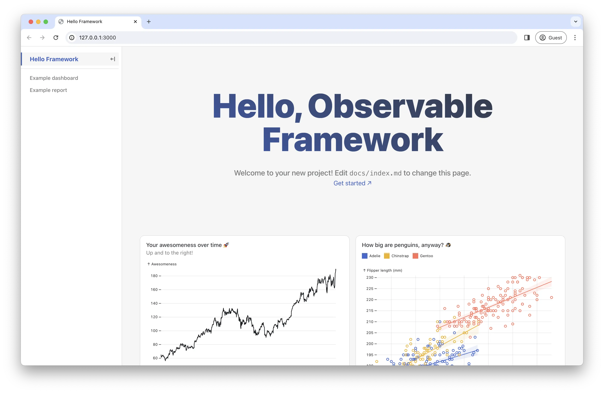
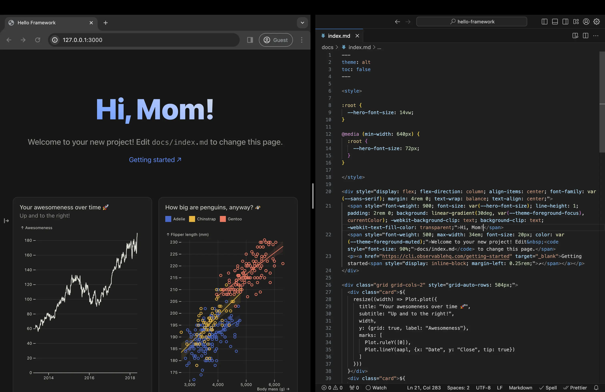
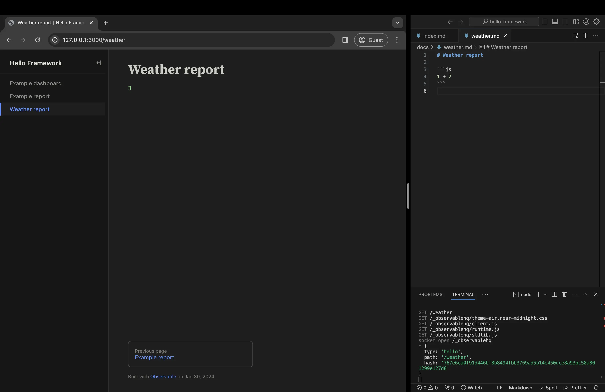
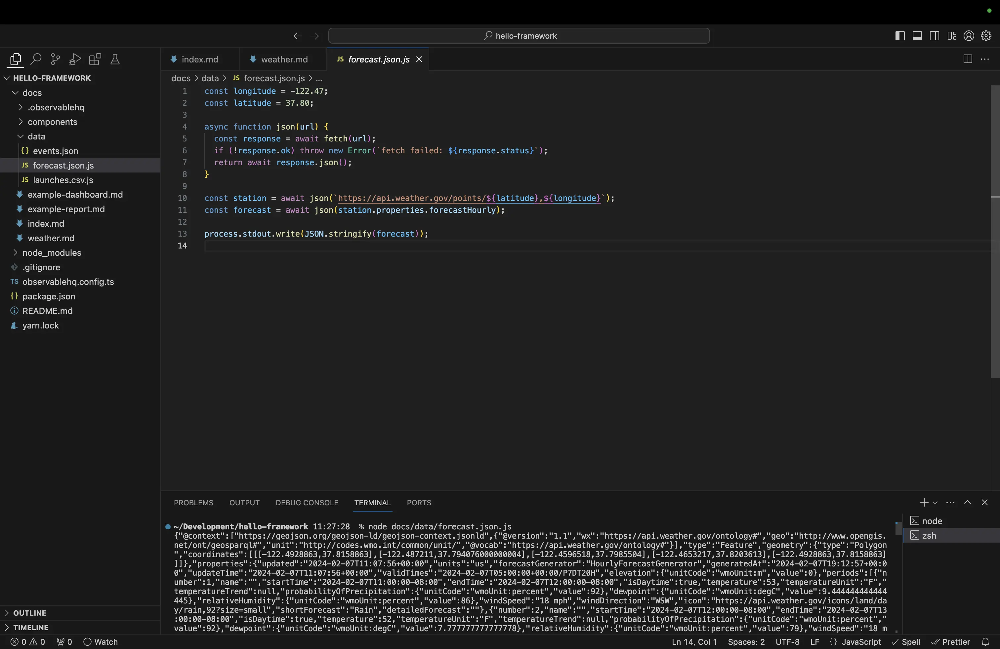
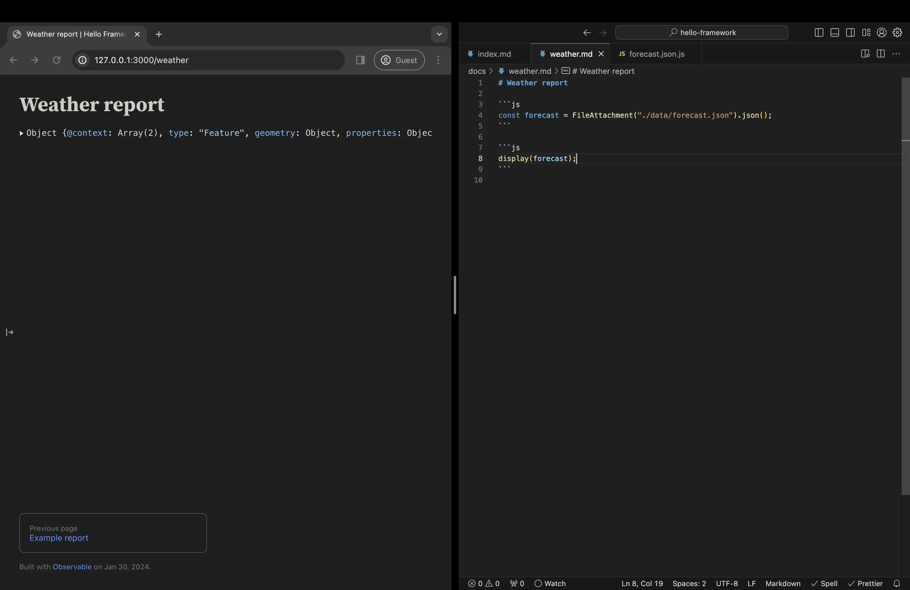
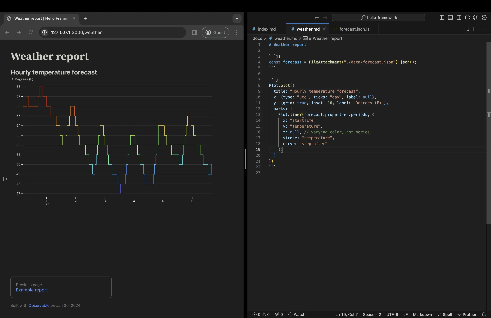
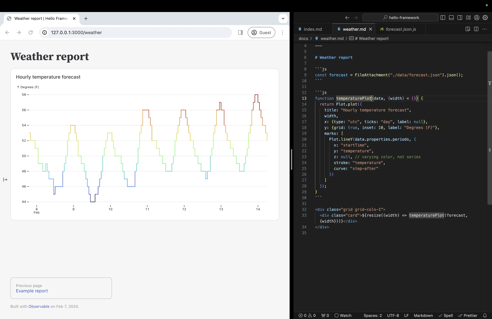

<style type="text/css">

.focus {
  color: var(--theme-foreground-focus);
}

.invert {
  background-color: var(--theme-foreground-alt);
  color: var(--theme-background);
}

.crop {
  border-radius: 8px;
  margin: 1rem;
  max-width: calc(100% - 2rem);
  box-shadow: 0 0 0 0.75px rgba(128, 128, 128, 0.2), 0 6px 12px 6px rgba(0, 0, 0, 0.4);
  aspect-ratio: 3024 / 1888;
  object-fit: cover;
  object-position: 0 100%;
}

.wbr::before {
  content: "\200b";
}

.wide {
  max-width: 960px;
}

figcaption code {
  font-size: 90%; /* TODO move to global.css */
}

</style>

# Getting started

Welcome! This tutorial will guide your first steps with Observable Framework by way of a hands-on exercise creating a dashboard of local weather. 🌦️

Observable Framework — or “Framework” for short — is an <a href="https://github.com/observablehq/framework">open-source</a> system for building data apps, dashboards, and reports that combines the power of JavaScript on the front-end for interactive graphics with any language you want on the back-end for data preparation and analysis.

Framework is three things in one:

- a **local development server** that you use to preview projects locally during development, with instant updates as you save changes,
- a **static site generator** that compiles Markdown, JavaScript, and other sources and static assets — alongside data snapshots generated by loaders — into a static site that you can host anywhere, and
- a **command-line interface** to Observable so that you can quickly and securely share your site with whomever you like (your boss, your team, the world).

We’ll touch on each of these parts in this tutorial. It’ll go something like this:

```js
const digraph = dot`digraph {
  rankdir=LR

  create -> edit -> preview -> build -> deploy -> view
  preview -> edit

  subgraph cluster_develop {
    label = "develop"
    color = "gray"
    edit
    preview
  }

  subgraph cluster_publish {
    label = "publish"
    color = "gray"
    build
    deploy
  }
}`;
```

<figure class="wide">
  ${digraph}
  <figcaption>An overview of developing with Framework.</figcaption>
</figure>

First you’ll setup your local development environment by [**creating**](#1.-create) a project. Next you’ll [**develop**](#2.-develop): an iterative process where you save changes to source files in your editor while previewing the result in your browser. When you’re ready to share, it’s time to [**publish**](#3.-publish): you can either build a static site for self-hosting or deploy directly to Observable. Lastly, you can invite people to view your project!

These are just first steps. You can continue to develop projects after publishing, and republish as needed. You can also setup continuous deployment to publish your site automatically on commit or on schedule. We’ll cover these [next steps](#next-steps) briefly below.

## 1. Create

Framework includes a helper script (`observable create`) for creating new projects. After a few quick prompts — where to create the project, your preferred package manager, *etc.* — it will stamp out a fresh project from a template.

<div class="tip">
  <p>Framework is a <a href="https://nodejs.org/">Node.js</a> application published to npm. You must have <a href="https://nodejs.org/en/download">Node.js 20.6 or later</a> installed before you can install Framework. Framework is a command-line interface (CLI) and runs in the terminal.</p>
  <p>If you run into difficulty following this tutorial, we’re happy to help! Please visit the <a href="https://talk.observablehq.com">Observable forum</a> or our <a href="https://github.com/observablehq/framework/discussions">GitHub discussions</a>.</p>
</div>

<div class="caution">Framework does not currently support Windows, though some users have had success with the <a href="https://learn.microsoft.com/en-us/windows/wsl/install">Windows Subsystem for Linux (WSL)</a>. It you are interested in Windows support, please upvote <a href="https://github.com/observablehq/framework/issues/90">#90</a>.</div>

To create a new project with npm, run:

<pre data-copy>npm init @observablehq</pre>

If you prefer Yarn, run:

<pre data-copy>yarn create @observablehq</pre>

You can run the above command anywhere, but you may want to `cd` to your `~/Development` directory first (or wherever you do local development).

The first prompt asks where to create your new project. Enter `./hello-framework` to create a directory named `hello-framework` within the current directory. Or just hit Enter, as this is conveniently the default. (The `./` is implied, so `./hello-framework` is equivalent to `hello-framework`. You can create a project in a different directory by entering a path that starts with `../` or `~/` or `/`.)

<pre data-copy="none"><span class="muted">┌</span>  <span class="invert"> observable create </span>
<span class="muted">│</span>
<span class="focus">◆</span>  Where to create your project?
<span class="focus">│</span>  ./hello-framework<span class="invert">&nbsp;</span>
<span class="focus">└</span></pre>

Next you’ll enter the project’s title. A project’s title appears in the sidebar as well as on all pages. You can hit Enter here to accept the default title derived from the directory name.

<pre data-copy="none"><span class="muted">┌</span>  <span class="invert"> observable create </span>
<span class="muted">│</span>
<span class="green">◇</span>  Where to create your project?
<span class="muted">│</span>  <span class="muted">./hello-framework</span>
<span class="muted">│</span>
<span class="focus">◆</span>  What to title your project?
<span class="focus">│</span>  <span class="muted"><span class="invert">H</span>ello Framework</span>
<span class="focus">└</span></pre>

Next, decide whether you want sample files in your new project. These files demonstrate common techniques and are handy for learning — you can edit the code and see what happens. But if you’d prefer a more minimal starter project with less to delete later, you can omit them. They’re not needed for this tutorial.

<pre data-copy="none"><span class="muted">┌</span>  <span class="invert"> observable create </span>
<span class="muted">│</span>
<span class="green">◇</span>  Where to create your project?
<span class="muted">│</span>  <span class="muted">./hello-framework</span>
<span class="muted">│</span>
<span class="green">◇</span>  What to title your project?
<span class="muted">│</span>  <span class="muted">Hello Framework</span>
<span class="muted">│</span>
<span class="focus">◆</span>  Include sample files to help you get started?
<span class="focus">│</span>  <span class="green">●</span> Yes, include sample files <span class="muted">(recommended)</span>
<span class="focus">│</span>  <span class="muted">○ No, create an empty project</span>
<span class="focus">└</span></pre>

If you use npm or Yarn as your preferred package manager, declare your allegiance now. The package manager you used to launch `observable create` will be selected by default, so you can just hit Enter again to continue. If you prefer a different package manager (say pnpm), choose `No`; you can always install dependencies after the project is created.

<pre data-copy="none"><span class="muted">┌</span>  <span class="invert"> observable create </span>
<span class="muted">│</span>
<span class="green">◇</span>  Where to create your project?
<span class="muted">│</span>  <span class="muted">./hello-framework</span>
<span class="muted">│</span>
<span class="green">◇</span>  What to title your project?
<span class="muted">│</span>  <span class="muted">Hello Framework</span>
<span class="muted">│</span>
<span class="green">◇</span>  Include sample files to help you get started?
<span class="muted">│</span>  <span class="muted">Yes, include sample files</span>
<span class="muted">│</span>
<span class="focus">◆</span>  Install dependencies?
<span class="focus">│</span>  <span class="muted">○ Yes, via npm</span>
<span class="focus">│</span>  <span class="green">●</span> Yes, via yarn <span class="muted">(recommended)</span>
<span class="focus">│</span>  <span class="muted">○ No</span>
<span class="focus">└</span></pre>

If you’ll continue developing your project after you finish this tutorial and want source control, answer `Yes` to initialize a git repository. Or say `No` — you can always do it later by running `git init`.

<pre data-copy="none"><span class="muted">┌</span>  <span class="invert"> observable create </span>
<span class="muted">│</span>
<span class="green">◇</span>  Where to create your project?
<span class="muted">│</span>  <span class="muted">./hello-framework</span>
<span class="muted">│</span>
<span class="green">◇</span>  What to title your project?
<span class="muted">│</span>  <span class="muted">Hello Framework</span>
<span class="muted">│</span>
<span class="green">◇</span>  Include sample files to help you get started?
<span class="muted">│</span>  <span class="muted">Yes, include sample files</span>
<span class="muted">│</span>
<span class="green">◇</span>  Install dependencies?
<span class="muted">│</span>  <span class="muted">Yes, via yarn</span>
<span class="muted">│</span>
<span class="focus">◆</span>  Initialize a git repository?
<span class="focus">│</span>  <span class="green">●</span> Yes <span class="muted">/ ○ No</span>
<span class="focus">└</span></pre>

And that’s it! After some downloading, copying, and installing, your new project is ready to go. 🎉

<pre data-copy="none"><span class="muted">┌</span>  <span class="invert"> observable create </span>
<span class="muted">│</span>
<span class="green">◇</span>  Where to create your project?
<span class="muted">│</span>  <span class="muted">./hello-framework</span>
<span class="muted">│</span>
<span class="green">◇</span>  What to title your project?
<span class="muted">│</span>  <span class="muted">Hello Framework</span>
<span class="muted">│</span>
<span class="green">◇</span>  Include sample files to help you get started?
<span class="muted">│</span>  <span class="muted">Yes, include sample files</span>
<span class="muted">│</span>
<span class="green">◇</span>  Install dependencies?
<span class="muted">│</span>  <span class="muted">Yes, via yarn</span>
<span class="muted">│</span>
<span class="green">◇</span>  Initialize a git repository?
<span class="muted">│</span>  <span class="muted">Yes</span>
<span class="muted">│</span>
<span class="green">◇</span>  Installed! 🎉
<span class="muted">│</span>
<span class="green">◇</span>  Next steps… <span class="muted">──────────╮</span>
<span class="muted">│</span>                        <span class="muted">│</span>
<span class="muted">│</span>  <span class="focus">cd ./hello-framework</span>  <span class="muted">│</span>
<span class="muted">│</span>  <span class="focus">yarn dev</span>              <span class="muted">│</span>
<span class="muted">│</span>                        <span class="muted">│</span>
<span class="muted">├────────────────────────╯</span>
<span class="muted">│</span>
<span class="muted">└</span>  Problems? <u><a href="https://observablehq.com/framework/getting-started" style="color: inherit;">https://observablehq.com/framework/getting-started</a></u></pre>

## 2. Develop

Next, `cd` into your new project folder.

<pre data-copy>cd hello-framework</pre>

Framework’s local development server lets you preview your site in the browser as you make rapid changes. The preview server generates pages on-the-fly: as you edit files in your editor, changes are instantly streamed to your browser.

<div class="tip">You can work offline with the preview server, but you must be connected to the internet to <a href="./javascript/imports">import libraries</a> from npm. In the future, we intend to support self-hosting imported libraries; please upvote <a href="https://github.com/observablehq/framework/issues/20">#20</a> and <a href="https://github.com/observablehq/framework/issues/360">#360</a> if you are interested in this feature.</div>

To start the preview server using npm:

<pre data-copy>npm run dev</pre>

Or with Yarn:

<pre data-copy>yarn dev</pre>

You should see something like this:

<pre data-copy="none"><b class="green">Observable Framework</b> v1.0.0
↳ <u><a href="http://127.0.0.1:3000/" style="color: inherit;">http://127.0.0.1:3000/</a></u></pre>

<div class="tip">
  <p>If port 3000 is in use, the preview server will choose the next available port, so your actual port may vary. To specify port 4321 (and similarly for any other port), use <nobr><code>--port 4321</code></nobr>.</p>
  <p>For security, the preview server is by default only accessible on your local machine using the <a href="https://en.wikipedia.org/wiki/Localhost">loopback address</a> 127.0.0.1. To allow remote connections, use <nobr><code>--host 0.0.0.0</code></nobr>.</p>
</div>

Now visit <http://127.0.0.1:3000> in your browser, which should look like:

<figure class="wide">
  <picture>
    <source srcset="./getting-started/hello-framework-dark.webp" media="(prefers-color-scheme: dark)">
    
  </picture>
  <figcaption>The default home page (<code>docs/index.md</code>) after creating a new project.</figcaption>
</figure>

### Test live preview

Live preview means that as you save changes, your in-browser preview updates instantly. Live preview applies to Markdown pages, imported JavaScript modules (so-called *hot module replacement*), data loaders, and file attachments. This feature is implemented by the preview server watching files and pushing changes to the browser over a socket.

To experience live preview, open <code>docs/index.md</code> in your preferred text editor — below we show Visual Studio Code — and position your browser window so that you can see your editor and browser side-by-side. If you then replace the text “Hello, Observable Framework” with “Hi, Mom!” and save, you should see:

<figure class="wide">
  <picture>
    <source srcset="./getting-started/hi-mom-dark.webp" media="(prefers-color-scheme: dark)">
    
  </picture>
  <figcaption>No seriously — hi, Mom! Thanks for supporting me all these years.</figcaption>
</figure>

<div class="tip">If you don’t see an update after saving, try reloading. The preview socket may disconnect if you’re idle. Please upvote <a href="https://github.com/observablehq/framework/issues/50">#50</a> if you run into this issue.</div>

### Create a new page

Now let’s add a page for our weather dashboard. Create a new file `docs/weather.md` and paste in the following snippet:

````md run=false
# Weather report

```js
display(1 + 2);
```
````

To see the new page in the sidebar, you must restart the preview server. In the terminal, use Control-C (⌃C) to kill the preview server. Then use up arrow (↑) to re-run the command to start the preview server (`npm run dev` or `yarn dev`). Lastly, reload your browser. A bit of rigamarole, but you won’t have to do it often… 😓 Upvote <a href="https://github.com/observablehq/framework/issues/645">#645</a> and <a href="https://github.com/observablehq/framework/issues/646">#646</a> if you’d like this to be better.

If you click on the **Weather report** link in the sidebar, it’ll take you to <http://127.0.0.1:3000/weather>, where you should see:

<figure class="wide">
  <picture>
    <source srcset="./getting-started/hello-weather-dark.webp" media="(prefers-color-scheme: dark)">
    
  </picture>
  <figcaption>The humble beginnings of a local weather dashboard.</figcaption>
</figure>

<div class="tip">The sidebar is hidden by default in narrow windows. If you don’t see the sidebar, you can show it by making the window wider, or using Command-B (⌘B) or Option-B (⌥B) on Firefox and non-macOS, or clicking the right-pointing arrow ↦ on the left edge of the window.</div>

As evidenced by the code <code class="language-js">1 + 2</code> rendered as <code class="language-js">3</code>, JavaScript fenced code blocks (<code>```js</code>) are *live*: the code runs in the browser. Try replacing <code class="language-js">2</code> with <code class="language-js">Math.random()</code>, and the code will re-run automatically on save. In a bit, we’ll write code to render a chart. We can also use code to debug as we develop, say to inspect data.

### Data loader

Next, let’s load some data. The [National Weather Service (NWS)](https://www.weather.gov/documentation/services-web-api) provides an excellent and free API for local weather data within the United States. We’ll use the `/points/{latitude},{longitude}` endpoint to get metadata for the closest grid point to the given location, and then fetch the corresponding hourly forecast.

Create a new file <code>docs/data/forecast.json.js</code> and paste in the following snippet:

<pre><code class="language-js">const longitude = ${html`<span class="hljs-number">${longitude.toFixed(2)}</span>`};
const latitude = ${html`<span class="hljs-number">${latitude.toFixed(2)}</span>`};

async function json(url) {
  const response = await fetch(url);
  if (!response.ok) throw new Error(`fetch failed: &dollar;{response.status}`);
  return await response.json();
}

const station = await json(`https://api.weather.gov/points/&dollar;{latitude},&dollar;{longitude}`);
const forecast = await json(station.properties.forecastHourly);

process.stdout.write(JSON.stringify(forecast));</code></pre>

```js
const location = view(Locator([-122.47, 37.8]));

function Locator(initialValue) {
  const form = html`<form style="font: 12px var(--sans-serif); display: flex; height: 33px; align-items: center;">
  <button name=b type=button style="margin-right: 0.5em;">Locate me</button>
  <output name=o></output>
</form>`;
  form.b.onclick = async event => {
    form.value = await new Promise((resolve, reject) => {
      navigator.geolocation.getCurrentPosition(
        ({coords: {longitude, latitude}}) => {
          form.o.value = "Located!";
          resolve([longitude, latitude]);
        },
        (error) => {
          form.o.value = "Error!";
          reject(error);
        }
      );
      form.o.value = "Locating…";
    });
    form.dispatchEvent(new CustomEvent("input", {bubbles: true}));
  };
  form.value = initialValue;
  return form;
}
```

```js
const [longitude, latitude] = location;
```

To personalize this code snippet to your current location, edit the <code>longitude</code> and <code>latitude</code> values above, or click the **Locate me** button above.

<div class="caution">NWS does not provide forecasts for points outside the United States, so if you specify such a location the API will return an error and the data loader will fail.</div>

<div class="tip">If you would rather write your data loader in Python, R, or some other language, take a peek at the <a href="#next-steps">next steps</a> below before continuing.</div>

Your data loader should look like this:

<figure class="wide">
  
  <figcaption>A JavaScript data loader for fetching a local forecast from weather.gov.</figcaption>
</figure>

If you like, you can run your data loader manually in the terminal:

<pre data-copy>node docs/data/forecast.json.js</pre>

If this barfs a bunch of JSON in the terminal, it’s working as intended. 😅 Normally you don’t run data loaders by hand — Framework runs them automatically, as needed — but data loaders are “just” programs so you can run them manually if you want. Conversely, any executable or shell script that runs on your machine and outputs something to stdout can be a data loader!

### File attachments

Framework uses [file-based routing](./routing) not just for pages but for data loaders as well: the data loader <code>forecast.json.js</code> serves the file <code>forecast.json</code>. To load this file from <code>docs<span class="wbr">/</span>weather.md</code> we use the relative path <code>./data<span class="wbr">/</span>forecast.json</code>. In effect, data loaders are simply a naming convention for generating “static” files — a big advantage of which is that you can edit a data loader and the changes immediately propagate to the live preview without needing a reload.

To load a file in JavaScript, use the built-in [`FileAttachment`](./javascript/files). In `weather.md`, replace the contents of the JavaScript code block (the parts inside the triple backticks <code>```</code>) with the following code:

```js run=false
const forecast = FileAttachment("./data/forecast.json").json();
```

<div class="note"><code>FileAttachment</code> is a special function that can only be passed a static string literal as an argument. This restriction enables static analysis, allowing Framework to determine which data loaders to run on build and improving security by only including referenced files in the published site.</div>

You can now reference the variable `forecast` from other code. For example, you can add another code block that displays the `forecast` data.

```js run=false
display(forecast);
```

This looks like:

<figure class="wide">
  <picture>
    <source srcset="./getting-started/hello-data-dark.webp" media="(prefers-color-scheme: dark)">
    
  </picture>
  <figcaption>Using <code>FileAttachment</code> to load data.</figcaption>
</figure>

The built-in [`display`](./javascript/display) function displays the specified value, a bit like `console.log` in the browser’s console. As you can see below, `display` is called [implicitly](./javascript/display#implicit-display) when a code block contains an expression:

```js echo
1 + 2
```

For convenience, here’s a copy of the data so you can explore it here:

```js
forecast
```

This is a GeoJSON `Feature` object of a `Polygon` geometry representing the grid square. The `properties` object within contains the hourly forecast data. You can display it on a map with <a href="./lib/leaflet">Leaflet</a>, if you like.

<figure class="wide">
  <div id="map" style="height: 400px; margin: 1rem 0; border-radius: 8px;"></div>
  <figcaption>This grid point covers the south end of the Golden Gate Bridge.</figcaption>
</figure>

```js
const ACCESS_TOKEN = "pk.eyJ1Ijoib2JzZXJ2YWJsZWhxLWVuZy1hZG1pbiIsImEiOiJjbHMxaTBwdDkwYnRsMmpxeG12M2kzdWFvIn0.Ga6eIWP2YNQrEW4FzHRcTQ";
const map = L.map(document.querySelector("#map"));
const tile = L.tileLayer(`https://api.mapbox.com/styles/v1/mapbox/streets-v11/tiles/256/{z}/{x}/{y}@2x?access_token=${ACCESS_TOKEN}`, {attribution: '© <a href="https://www.mapbox.com/feedback/">Mapbox</a> © <a href="http://www.openstreetmap.org/copyright">OpenStreetMap</a>'}).addTo(map);
const geo = L.geoJSON().addData(forecast).addTo(map);
map.fitBounds(geo.getBounds(), {padding: [50, 50]});
invalidation.then(() => map.remove());
```

```js
const forecast = FileAttachment("./data/forecast.json").json();
```

### Plots

Now let’s add a chart using <a href="./lib/plot">Observable Plot</a>. Framework includes a variety of <a href="./javascript/imports#implicit-imports">recommended libraries</a> by default, including `Plot`, and you can always <a href="./javascript/imports">import more</a> from npm. Replace the `display(forecast)` code block with the following code:

```js run=false
display(
  Plot.plot({
    title: "Hourly temperature forecast",
    x: {type: "utc", ticks: "day", label: null},
    y: {grid: true, inset: 10, label: "Degrees (F)"},
    marks: [
      Plot.lineY(forecast.properties.periods, {
        x: "startTime",
        y: "temperature",
        z: null, // varying color, not series
        stroke: "temperature",
        curve: "step-after"
      })
    ]
  })
);
```

<div class="note">Because this is JSON data, <code>startTime</code> is a <code>string</code> rather than a <code>Date</code>. Setting the <code>type</code> of the <code>x</code> scale to <code>utc</code> tells Plot to interpret these values as temporal rather than ordinal.</div>

You should now see:

<figure class="wide">
  <picture>
    <source srcset="./getting-started/hello-plot-dark.webp" media="(prefers-color-scheme: dark)">
    
  </picture>
  <figcaption>Using <code>Plot</code> to make a chart.</figcaption>
</figure>

<div class="tip">Try editing <code>forecast.json.js</code> to change the <code>longitude</code> and <code>latitude</code> to a different location! After you save, Framework will run the data loader again and push the new data to the client to update the chart. For example, to see the current forecast at the White House:<pre><code class="language-js">const longitude = -77.04;
const latitude = 38.90;</code></pre></div>

As before, the code block contains an expression (a call to `Plot.plot`) and hence `display` is called implicitly. And since this expression evaluates to a DOM element (a `<figure>` containing an `<svg>`), `display` inserts the element directly into the page. We didn’t have to touch the DOM API!

### Components

As pages grow, complex inline JavaScript may become unwieldy and repetitive. Tidy code by moving it into functions. In Framework, a function that returns a DOM element is called a *component*.

To turn the chart above into a component, wrap it in a function and promote the `data` to a required argument. Accept any named options (such as `width`) as an optional second argument with destructuring.

```js echo
function temperaturePlot(data, {width} = {}) {
  return Plot.plot({
    title: "Hourly temperature forecast",
    width,
    x: {type: "utc", ticks: "day", label: null},
    y: {grid: true, inset: 10, label: "Degrees (F)"},
    marks: [
      Plot.lineY(data.properties.periods, {
        x: "startTime",
        y: "temperature",
        z: null, // varying color, not series
        stroke: "temperature",
        curve: "step-after"
      })
    ]
  });
}
```

Now you can call `temperaturePlot` to display the forecast anywhere on the page:

```js run=false
display(temperaturePlot(forecast));
```

<div class="tip">JavaScript can be extracted into standalone modules (<code>.js</code> files) that you can <a href="./javascript/imports">import</a> into Markdown. This lets you share code across pages, write unit tests for components, and more.</div>

### Layout

Let’s put some finishing touches on and wrap up this tutorial.

While this nascent dashboard only has a single chart on it, most dashboards will have many charts, tables, values, and other elements. To assist layout, Framework includes simple `grid` and `card` CSS classes with 1, 2, 3, or 4 columns. (You can write more elaborate custom styles if needed, or load your preferred CSS framework.)

For example, here’s a two-column grid with three cards:

```html echo
<div class="grid grid-cols-2">
  <div class="card grid-colspan-2">one–two</div>
  <div class="card">three</div>
  <div class="card">four</div>
</div>
```

<div class="note">Framework’s grid is responsive: on narrow windows, the two-column grid will automatically collapse to a one-column grid. Cells in a grid have the same height by default (using <code>grid-auto-rows</code>), so consider separate <code>&lt;div class="grid"&gt;</code> containers if you want to vary row height.</div>

When placing charts in a grid, you typically want to render responsively based on the width (and sometimes height) of the containing cell. Framework’s `resize` helper takes a render function returning a DOM element and re-renders whenever the container resizes. It looks like this:

```html echo
<div class="grid grid-cols-1">
  <div class="card">${resize((width) => temperaturePlot(forecast, {width}))}</div>
</div>
```

Lastly, let’s apply the `dashboard` [theme](./themes) and disable the table of contents (`toc`) using [YAML front matter](./markdown). The `dashboard` theme allows the main column to span the full width of the window; without it, the main column width is limited to 1152px as appropriate for documentation or a report.

```yaml run=false
---
theme: dashboard
toc: false
---
```

<figure class="wide">
  <picture>
    <source srcset="./getting-started/hello-grid-dark.webp" media="(prefers-color-scheme: dark)">
    
  </picture>
  <figcaption>Adopting a grid layout and the <code>dashboard</code> theme.</figcaption>
</figure>

_Ta-da!_ 🎉 Perhaps not the most exciting dashboard yet, but it has potential! Try exploring other data in the NWS forecast and adding more charts. For example, you could visualize precipitation probability.

## 3. Publish

When you’re ready to share your project — whether privately with specific people you want to invite, or publicly with the world — you can quickly deploy it to [Observable](https://observablehq.com) using the `deploy` command:

<pre data-copy>npm run deploy</pre>

Or with Yarn:

<pre data-copy>yarn deploy</pre>

<div class="note">If you don’t have an Observable account yet, the first time you deploy you’ll be prompted to create one. Observable is free for individuals and small teams, and we offer paid tiers for larger teams.</div>

If this is your first time deploying to Observable, you’ll be prompted to create a new project. This determines where you project lives on Observable.

<div class="tip">Your deploy configuration is saved to <code>docs<span class="wbr">/</span>.observablehq<span class="wbr">/</span>deploy.json</code>. When collaborating on a project, you should commit this file to git so your collaborators don’t have to separately configure deploy.</div>

<pre data-copy="none">
<span class="muted">┌</span>  <span class="invert"> observable deploy </span>
<span class="muted">│</span>
<span class="blue">●</span>  To configure deploy, we need to ask you a few questions.
<span class="muted">│</span>
<span class="green">◇</span>  Deploying to the <b>ACME Inc. (@acme)</b> workspace.
<span class="muted">│</span>
<span class="blue">◆</span>  No projects found. Do you want to create a new project?
<span class="blue">│</span>  <span class="green">●</span> Yes, continue / <span class="muted">○ No, cancel</span>
<span class="blue">└</span>
</pre>

<div class="note">If you have multiple workspaces on Observable, you’ll be prompted to chose a workspace before creating a project. And if you’ve previously deployed projects to your chosen workspace, you can chose to deploy to an existing project, overwriting its contents.</div>

When creating a new project, you need to specify a <i>slug</i> which — together with your workspace username — determines the URL of your project. The slug is a short identifier consisting of lowercase letters, numbers, and hyphens. By default, Framework will suggest a slug based on your project’s title.

<pre data-copy="none">
<span class="muted">┌</span>  <span class="invert"> observable deploy </span>
<span class="muted">│</span>
<span class="blue">●</span>  To configure deploy, we need to ask you a few questions.
<span class="muted">│</span>
<span class="green">◇</span>  Which Observable workspace do you want to use?
<span class="muted">│  ACME Inc. (@acme)</span>
<span class="muted">│</span>
<span class="green">◇</span>  Which project do you want to use?
<span class="muted">│  Create a new project</span>
<span class="muted">│</span>
<span class="blue">◆</span>  What slug do you want to use?
<span class="blue">│</span>  <span class="muted"><span class="invert">h</span>ello-framework</span>
<span class="blue">└</span>
</pre>

<div class="tip">You can change the slug later, and Observable will automatically redirect to the latest URL.</div>

Lastly, you can enter an optional deploy message. Deploy messages are shown on Observable and help you keep track of deploy history. For now, you can just leave this blank by hitting Enter.

<pre data-copy="none">
<span class="muted">┌</span>  <span class="invert"> observable deploy </span>
<span class="muted">│</span>
<span class="blue">●</span>  To configure deploy, we need to ask you a few questions.
<span class="muted">│</span>
<span class="green">◇</span>  Which Observable workspace do you want to use?
<span class="muted">│  ACME Inc. (@acme)</span>
<span class="muted">│</span>
<span class="green">◇</span>  Which project do you want to use?
<span class="muted">│  Create a new project</span>
<span class="muted">│</span>
<span class="green">◇</span>  What slug do you want to use?
<span class="muted">│  hello-framework</span>
<span class="muted">│</span>
<span class="blue">◆</span>  What changed in this deploy?
<span class="blue">│</span>  <span class="muted"><span class="invert">E</span>nter a deploy message (optional)</span>
<span class="blue">└</span>
</pre>

<div class="tip">Deploy messages can be set using <code>deploy <nobr>--message</nobr></code>. This is especially useful for continuous deployment from a git repository: the message can include the SHA, author, and message of the latest commit.</div>

When deploy completes, Framework will show your project’s URL on observablehq.cloud. From there you can invite people to your private workspace to see your project, or make your project public so anyone can see it.

### Self hosting

Of course, you don’t have to deploy to Observable — Framework projects are simply static sites, so you can host them anywhere!

To build your static site with npm, run:

<pre data-copy>npm run build</pre>

Or with Yarn:

<pre data-copy>yarn build</pre>

The <code>build</code> command generates the `dist` directory; you can then copy this directory to your static site server or preferred hosting service. To preview your built site locally, you can use a local static HTTP server such as [http-server](https://github.com/http-party/http-server):

<pre data-copy>npx http-server dist</pre>

## Next steps

Here are a few more tips.

### Write a data loader in Python, R, or other language

We coded exclusively in JavaScript for this tutorial, but you can write data loaders in any language — not just JavaScript. Here’s a <code>forecast.json.py</code> you could use in place of the JavaScript data loader [above](#data-loader):

```py run=false
import json
import requests
import sys

longitude = -122.47
latitude = 37.80

station = requests.get(f"https://api.weather.gov/points/{latitude},{longitude}").json()
forecast = requests.get(station["properties"]["forecastHourly"]).json()

json.dump(forecast, sys.stdout)
```

To write the data loader in R, name it <code>forecast.json.R</code>. Or as shell script, <code>forecast.json.sh</code>. You get the idea. See [Data loaders: Routing](./loaders#routing) for more. The beauty of this approach is that you can leverage the strengths (and libraries) of multiple languages, and still get instant updates in the browser as you develop.

### Deploying via GitHub Actions

You can schedule builds and deploy your project automatically on commit, or on a schedule. See <a href="https://github.com/observablehq/framework/blob/main/.github/workflows/deploy.yml">this documentation site’s deploy.yml</a> for an example.

### Ask for help, or share your feedback

Please reach out if you have questions or thoughts! You can post on the <a href="https://talk.observablehq.com/">Observable forum</a>, start a <a href="https://github.com/observablehq/framework/discussions">GitHub discussion</a>, or file a <a href="https://github.com/observablehq/framework/issues">GitHub issue</a>. And if you like Framework, please give us a star ⭐️ on <a href="https://github.com/observablehq/framework">GitHub</a> — we appreciate your support. 🙏
