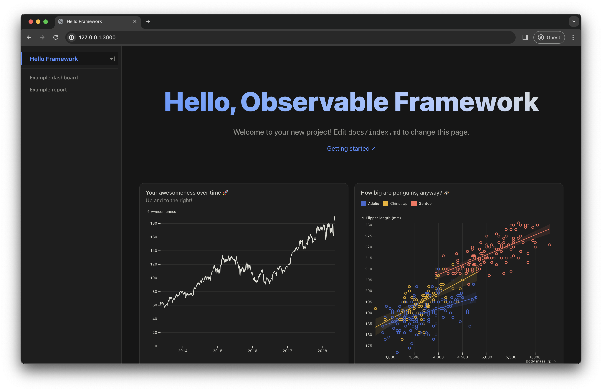
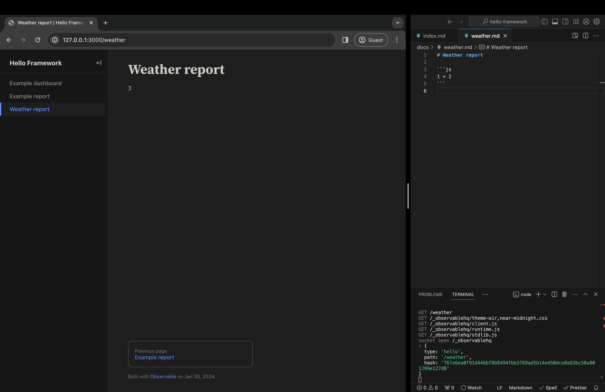
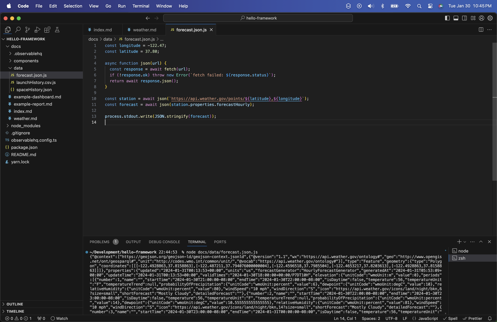
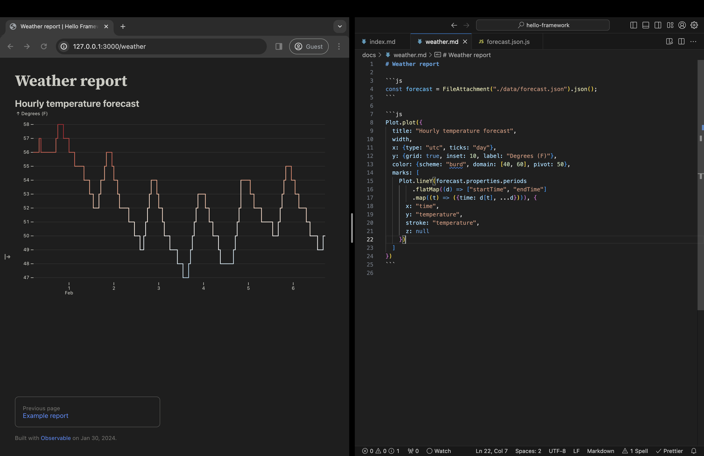
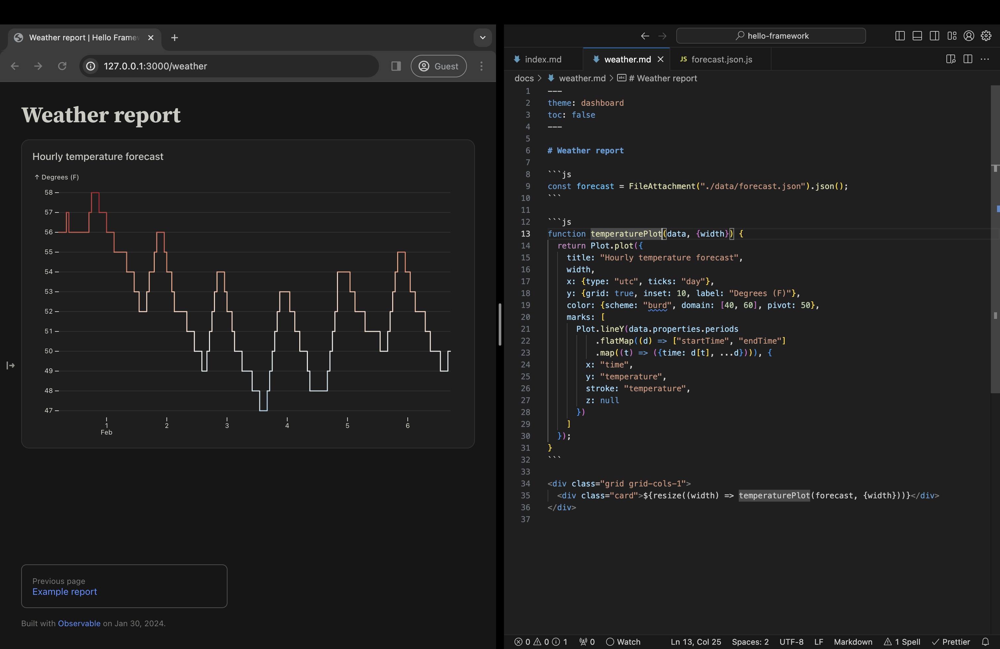

<style type="text/css">

.focus {
  color: var(--theme-foreground-focus);
}

.invert {
  background-color: var(--theme-foreground-alt);
  color: var(--theme-background);
}

.crop {
  border-radius: 8px;
  border: solid 1px #333;
  margin: 1rem;
  max-width: calc(100% - 2rem);
  box-shadow: 0 6px 12px 6px rgba(0, 0, 0, 0.4);
  aspect-ratio: 3024 / 1888;
  object-fit: cover;
  object-position: 0 100%;
}

.wbr::before {
  content: "\200b";
}

figcaption code {
  font-size: 90%; /* TODO move to global.css */
}

</style>

# Getting started

Welcome! This tutorial will guide your first steps with Observable Framework by way of a hands-on exercise creating a dashboard of local weather. 🌦️

But first, what is Observable Framework — or “Framework” for short? Framework is… well… an <a href="https://github.com/observablehq/cli">open-source</a> *framework* for building data apps that combines the power of JavaScript for interactive graphics on the front-end with any language you want for data preparation and analysis on the back-end.

Framework is three things in one:

- a **local development server** that you use to preview projects locally during development, with instant updates as you save changes,
- a **static site generator** that compiles Markdown, JavaScript, and other sources and static assets — alongside data snapshots generated dynamically by loaders — into a static site that you can host anywhere, and
- a **command-line interface** to Observable so that you can quickly and securely share your site with your team (or the world, or whoever).

We’ll touch on each of these parts in this tutorial. It’ll go something like this:

```js
const digraph = dot`digraph {
  rankdir=LR

  create -> edit -> preview -> build -> deploy -> view
  preview -> edit

  subgraph cluster_develop {
    label = "develop"
    color = "gray"
    edit
    preview
  }

  subgraph cluster_publish {
    label = "publish"
    color = "gray"
    build
    deploy
  }
}`;
```

<figure style="max-width: 960px;">
  ${digraph}
  <figcaption>An overview of developing with Framework.</figcaption>
</figure>

First you’ll setup your local development environment by [**creating**](#1.-create) a project. &para;&nbsp;Next you’ll [**develop**](#2.-develop): an iterative process where you save changes to source files in your editor while previewing the result in your browser. &para;&nbsp;When you’re ready to share, it’s time to [**publish**](#3.-publish): you can either build a static site for self-hosting or deploy directly to Observable. &para;&nbsp;Lastly, you can invite people to [**view**](#4.-view) your project!

These are just first steps. Naturally, you can continue to develop projects after you publish, and republish projects to make changes live or update data. If you like, you can setup continuous deployment to build your site automatically on commit or on schedule. We’ll cover these [next steps](#next-steps) briefly below.

And _awaAay_ we go… 🚀

## 1. Create

Framework includes a helper script (`observable create`) for creating new projects. After a few quick prompts — where to create the project, your preferred package manager, *etc.* — it will stamp out a fresh project from a template.

<div class="tip">
  <p>Framework is a <a href="https://nodejs.org/">Node.js</a> application published to npm. You must have <a href="https://nodejs.org/en/download">Node.js 20.6 or later</a> installed before you can install Framework. Framework is a command-line interface (CLI) and runs in the terminal.</p>
  <p>If you run into difficulty following this tutorial, we’re happy to help! Please visit the <a href="https://talk.observablehq.com">Observable Forum</a> or our <a href="https://github.com/observablehq/cli/discussions">GitHub discussions</a>.</p>
</div>

To create a new project with `npm`, run:

```sh
npm init @observablehq
```

Or to create a new project with `yarn`, run:

```sh
yarn create @observablehq
```

You can run the above command anywhere, but you may want to `cd` to your `~/Development` directory first (or wherever you do local development).

For the first prompt, you’ll specify where to create your new project. Enter `./hello-framework` to create a directory named `hello-framework` within the current directory. Or just hit Enter, as this is conveniently the default. (The `./` is implied, so `./hello-framework` is equivalent to `hello-framework`. You can create a project in a different directory by entering a path that starts with `../` or `~/` or `/`.)

<pre><span class="muted">┌</span>  <span class="invert"> observable create </span>
<span class="muted">│</span>
<span class="focus">◆</span>  Where to create your project?
<span class="focus">│</span>  ./hello-framework<span class="invert">&nbsp;</span>
<span class="focus">└</span></pre>

Next you’ll enter the project’s title. A project’s title appears in the sidebar as well as on all pages. (A memorable title will make your project easier to find in your browser history, for one.) You can hit Enter here to accept the default title derived from the directory you entered in the previous step.

<pre><span class="muted">┌</span>  <span class="invert"> observable create </span>
<span class="muted">│</span>
<span class="green">◇</span>  Where to create your project?
<span class="muted">│</span>  <span class="muted">./hello-framework</span>
<span class="muted">│</span>
<span class="focus">◆</span>  What to title your project?
<span class="focus">│</span>  <span class="muted"><span class="invert">H</span>ello Framework</span>
<span class="focus">└</span></pre>

Next, decide whether you want sample files in your new project. These files demonstrate common techniques and are handy for learning — you can edit the code and see what happens. But if you’d prefer a more minimal starter project, with less to delete later, you can omit them now. We recommend you include them (again, _learning_), but they’re not needed for this tutorial.

<pre><span class="muted">┌</span>  <span class="invert"> observable create </span>
<span class="muted">│</span>
<span class="green">◇</span>  Where to create your project?
<span class="muted">│</span>  <span class="muted">./hello-framework</span>
<span class="muted">│</span>
<span class="green">◇</span>  What to title your project?
<span class="muted">│</span>  <span class="muted">Hello Framework</span>
<span class="muted">│</span>
<span class="focus">◆</span>  Include sample files to help you get started?
<span class="focus">│</span>  <span class="green">●</span> Yes, include sample files <span class="muted">(recommended)</span>
<span class="focus">│</span>  <span class="muted">○ No, create an empty project</span>
<span class="focus">└</span></pre>

If you use `npm` or `yarn` as your preferred package manager, declare your allegiance now. The package manager you used to launch `observable create` will be selected by default, so you can just hit Enter again to continue. If you prefer a different package manager (say `pnpm`), choose `No`; you can install dependencies yourself after the project is created.

<pre><span class="muted">┌</span>  <span class="invert"> observable create </span>
<span class="muted">│</span>
<span class="green">◇</span>  Where to create your project?
<span class="muted">│</span>  <span class="muted">./hello-framework</span>
<span class="muted">│</span>
<span class="green">◇</span>  What to title your project?
<span class="muted">│</span>  <span class="muted">Hello Framework</span>
<span class="muted">│</span>
<span class="green">◇</span>  Include sample files to help you get started?
<span class="muted">│</span>  <span class="muted">Yes, include sample files</span>
<span class="muted">│</span>
<span class="focus">◆</span>  Install dependencies?
<span class="focus">│</span>  <span class="muted">○ Yes, via npm</span>
<span class="focus">│</span>  <span class="green">●</span> Yes, via yarn <span class="muted">(recommended)</span>
<span class="focus">│</span>  <span class="muted">○ No</span>
<span class="focus">└</span></pre>

If you’ll continue developing after you finish this tutorial, you’ll likely want source control to track changes; answer `Yes` to initialize a git repository. Or say `No` — you can always do it later by running `git init`.

<pre><span class="muted">┌</span>  <span class="invert"> observable create </span>
<span class="muted">│</span>
<span class="green">◇</span>  Where to create your project?
<span class="muted">│</span>  <span class="muted">./hello-framework</span>
<span class="muted">│</span>
<span class="green">◇</span>  What to title your project?
<span class="muted">│</span>  <span class="muted">Hello Framework</span>
<span class="muted">│</span>
<span class="green">◇</span>  Include sample files to help you get started?
<span class="muted">│</span>  <span class="muted">Yes, include sample files</span>
<span class="muted">│</span>
<span class="green">◇</span>  Install dependencies?
<span class="muted">│</span>  <span class="muted">Yes, via yarn</span>
<span class="muted">│</span>
<span class="focus">◆</span>  Initialize a git repository?
<span class="focus">│</span>  <span class="green">●</span> Yes <span class="muted">/ ○ No</span>
<span class="focus">└</span></pre>

And that’s it! After some downloading, copying, and installing, your new project will be ready to go. 🎉

<pre><span class="muted">┌</span>  <span class="invert"> observable create </span>
<span class="muted">│</span>
<span class="green">◇</span>  Where to create your project?
<span class="muted">│</span>  <span class="muted">./hello-framework</span>
<span class="muted">│</span>
<span class="green">◇</span>  What to title your project?
<span class="muted">│</span>  <span class="muted">Hello Framework</span>
<span class="muted">│</span>
<span class="green">◇</span>  Include sample files to help you get started?
<span class="muted">│</span>  <span class="muted">Yes, include sample files</span>
<span class="muted">│</span>
<span class="green">◇</span>  Install dependencies?
<span class="muted">│</span>  <span class="muted">Yes, via yarn</span>
<span class="muted">│</span>
<span class="green">◇</span>  Initialize a git repository?
<span class="muted">│</span>  <span class="muted">Yes</span>
<span class="muted">│</span>
<span class="green">◇</span>  Installed! 🎉
<span class="muted">│</span>
<span class="green">◇</span>  Next steps…
<span class="muted">│</span>
<span class="muted">│</span>  <span class="focus">cd ./hello-framework</span>
<span class="muted">│</span>  <span class="focus">yarn dev</span>
<span class="muted">│</span>
<span class="muted">└</span>  Problems? <u>https://cli.observablehq.com/getting-started</u></pre>

## 2. Develop

Next, `cd` into your new project folder.

```sh
cd hello-framework
```

Framework’s local development server lets you preview your site in the browser as you make rapid changes. The preview server generates pages on-the-fly: as you edit files in your editor, changes are instantly streamed to your browser.

<div class="tip">You can work offline with the preview server, but you must be connected to the internet to <a href="./javascript/imports">import libraries</a> from npm. In the future, we intend to support self-hosting imported libraries; please upvote <a href="https://github.com/observablehq/cli/issues/20">#20</a> and <a href="https://github.com/observablehq/cli/issues/360">#360</a> if you are interested in this feature.</div>

To start the preview server using `npm`:

```sh
npm run dev
```

Or to start the preview server using `yarn`:

```sh
yarn dev
```

You should see something like this:

<pre><b class="green">Observable Framework</b>     v1.0.0
↳ <u>http://127.0.0.1:3000/</u></pre>

<div class="tip">
  <p>If port 3000 is in use, the preview server will choose the next available port, so your actual port may vary. To specify port 4321 (and similarly for any other port), use <nobr><code>--port 4321</code></nobr>.</p>
  <p>For security, the preview server is by default only accessible on your local machine using the <a href="https://en.wikipedia.org/wiki/Localhost">loopback address</a> 127.0.0.1. To allow remote connections, use <nobr><code>--host 0.0.0.0</code></nobr>.</p>
</div>

Now visit <http://127.0.0.1:3000> in your browser, which should look like:

<figure>
  
  <figcaption>The default home page (<code>docs/index.md</code>) after creating a new project.</figcaption>
</figure>

### Test live preview

Live preview means that as you save changes, your in-browser preview updates instantly. Live preview applies to Markdown pages, imported JavaScript modules (so-called *hot module replacement*), data loaders, and file attachments. This feature is implemented by the preview server watching files and pushing changes to the browser over a socket.

To experience live preview, first open <code>docs/index.md</code> in your preferred text editor — below we show Visual Studio Code — and position your browser window so that you can see your editor and browser side-by-side. If you then replace the text “Hello, Observable Framework” with “Hi, Mom!” and save, you should see:

<figure>
  
  <figcaption>No seriously — hi, Mom! Thanks for supporting me all these years.</figcaption>
</figure>

<div class="tip">Try reloading if you don’t see an update after saving. The live preview socket may disconnect if you’re idle. Please upvote <a href="https://github.com/observablehq/cli/issues/50">#50</a> if you run into this issue.</div>

### Create a new page

Now let’s create a new page for our weather dashboard. Create a new file `docs/weather.md` and paste in the following snippet:

````md run=false
# Weather report

```js
1 + 2
```
````

<div class="tip">Hover any code block to show a copy button. Clicking the copy button will copy the contents of the code block to your clipboard.</div>

To see the new page in the sidebar, you must restart the preview server. In the terminal, use Control-C (⌃C) to kill the preview server. Then use up arrow (↑) to re-run the command to start the preview server (`npm run dev` or `yarn dev`). Lastly, reload your browser.

That’s a bit of rigamarole, but you won’t have to do it very often. 😓 If you click on the **Weather report** link in the sidebar, it’ll take you to <http://127.0.0.1:3000/weather>, where you should see:

<figure>
  
  <figcaption>The humble beginnings of a local weather dashboard.</figcaption>
</figure>

<div class="tip">If you don’t see the sidebar, you can show it by making the window wider, using Command-B (⌘B) or Option-B (⌥B) on Firefox and non-macOS, or clicking the little right-pointing arrow ↦ on the left edge of the window.</div>

As evinced by the code <code class="language-js">1 + 2</code> rendered as <code class="language-js">3</code>, JavaScript fenced code blocks (<code>```js</code>) are *live* — the code runs in the browser. Feel free to tinker, say to replace the <code class="language-js">2</code> with <code class="language-js">Math.random()</code>. In a bit, we’ll write code to render a chart. We can also use code to debug as we develop, say to inspect data.

### Data loader

Next, let’s load some data. The [National Weather Service (NWS)](https://www.weather.gov/documentation/services-web-api) provides an excellent and free API for local weather data within the United States. We’ll use the `/points/{latitude},{longitude}` endpoint to get metadata for the closest grid point to the given location, and then we’ll fetch the corresponding hourly forecast.

Create a new file <code>docs/data/forecast.json.js</code> and paste in the following snippet:

<pre><code class="language-js">const longitude = ${html`<span class="hljs-number">${longitude.toFixed(2)}</span>`};
const latitude = ${html`<span class="hljs-number">${latitude.toFixed(2)}</span>`};

async function json(url) {
  const response = await fetch(url);
  if (!response.ok) throw new Error(`fetch failed: &dollar;{response.status}`);
  return await response.json();
}

const station = await json(`https://api.weather.gov/points/&dollar;{latitude},&dollar;{longitude}`);
const forecast = await json(station.properties.forecastHourly);

process.stdout.write(JSON.stringify(forecast));</pre>

```js
const location = view(Locator([-122.47, 37.8]));

function Locator(initialValue) {
  const form = html`<form style="font: 12px var(--sans-serif); display: flex; height: 33px; align-items: center;">
  <button name=b type=button style="margin-right: 0.5em;">Locate me</button>
  <output name=o></output>
</form>`;
  form.b.onclick = async event => {
    form.value = await new Promise((resolve, reject) => {
      navigator.geolocation.getCurrentPosition(
        ({coords: {longitude, latitude}}) => {
          form.o.value = "Located!";
          resolve([longitude, latitude]);
        },
        (error) => {
          form.o.value = "Error!";
          reject(error);
        }
      );
      form.o.value = "Locating…";
    });
    form.dispatchEvent(new CustomEvent("input", {bubbles: true}));
  };
  form.value = initialValue;
  return form;
}
```

```js
const [longitude, latitude] = location;
```

To personalize this code snippet to your current location, edit the <code>longitude</code> and <code>latitude</code> values above, or click the **Locate me** button above.

Your data loader should look like this:

<figure>
  
  <figcaption>A JavaScript data loader for fetching a local forecast from weather.gov.</figcaption>
</figure>

If you like, you can run your data loader manually in the terminal:

```sh
node docs/data/forecast.json.js
```

If this barfs a bunch of JSON in the terminal, it’s working as intended. 😅 Normally you don’t run data loaders by hand — Framework runs them automatically — but data loaders are “just programs” so you can run them manually if you want.

<div class="tip">If you’d like an additional challenge and would rather write your data loader in another language, such as Python or R, take a peek at the <a href="#next-steps">next steps</a> below before continuing.</div>

### File attachments

How do we access the output of a data loader in the client? The same way that we’d access any static file. But we don’t use `fetch`, we use `FileAttachment`, because Framework needs to know statically which files are referenced so they can be included in the published site on build.

Framework uses [file-based routing](./routing) not just for pages but for data loaders as well. The data loader <code>forecast.json.js</code> generates the file <code>forecast.json</code>. That is:

```
docs/data/forecast.json.js → docs/data/forecast.json
```

So to load this (generated) file from <code>docs<span class="wbr">/</span>weather.md</code> we can use the relative path <code>./data<span class="wbr">/</span>forecast.json</code>:

```
docs/weather.md + ./data/forecast.json = docs/data/forecast.json
```

We need to use <code>FileAttachment</code>.

Framework uses static analysis so it knows to run the data loader during build.

Back in `weather.md`, replace the contents of the JavaScript code block (the parts within the triple backticks <code>```</code>) with the following code snippet:

```js run=false
const forecast = FileAttachment("./data/forecast.json").json();
```

This declares a variable `forecast` that you can then reference from other code. For example, you can add another code block that displays the `forecast` data.

```js run=false
display(forecast);
```

You’ll see something like:

<figure>
  
  <figcaption>Using <code>FileAttachment</code> to load data.</figcaption>
</figure>

Here’s the object so you can explore it here:

```js
forecast
```

(This documentation site is built with Framework!)

```js
const forecast = FileAttachment("./data/forecast.json").json();
```

### Plots

Now let’s add a chart using Observable Plot which is available as `Plot`.

Replace the `display(forecast)` code block with the following code:

```js run=false
Plot.plot({
  title: "Hourly temperature forecast",
  width,
  x: {type: "utc", ticks: "day"},
  y: {grid: true, inset: 10, label: "Degrees (F)"},
  color: {scheme: "burd", domain: [40, 60], pivot: 50},
  marks: [
    Plot.lineY(forecast.properties.periods
        .flatMap((d) => ["startTime", "endTime"]
        .map((t) => ({time: d[t], ...d}))), {
      x: "time",
      y: "temperature",
      stroke: "temperature",
      z: null
    })
  ]
})
```

Now you’ll see…

<figure>
  
  <figcaption>Using <code>Plot</code> to make a chart.</figcaption>
</figure>

It’s responsive using `width`.

Extract into a function, promote `data` to an argument and `width` to an option…

```js run=false
function temperaturePlot(data, {width}) {
  return Plot.plot({
    title: "Hourly temperature forecast",
    width,
    x: {type: "utc", ticks: "day"},
    y: {grid: true, inset: 10, label: "Degrees (F)"},
    color: {scheme: "burd", domain: [40, 60], pivot: 50},
    marks: [
      Plot.lineY(forecast.properties.periods
          .flatMap((d) => ["startTime", "endTime"]
          .map((t) => ({time: d[t], ...d}))), {
        x: "time",
        y: "temperature",
        stroke: "temperature",
        z: null
      })
    ]
  });
}
```

Move it into a grid, use `resize` instead of `width`…

```html run=false
<div class="grid grid-cols-1">
  <div class="card">${resize((width) => temperaturePlot(forecast, {width}))}</div>
</div>
```

Apply the dashboard theme…

```yaml run=false
---
theme: dashboard
toc: false
---
```

<figure>
  
  <figcaption>Adopting a grid layout and the <code>dashboard</code> theme.</figcaption>
</figure>

Okay that’s a pretty lame dashboard but it’s something.

## 3. Publish

When you’re ready to deploy your project, use the `build` command to generate the output root (`dist`). You can then copy the `dist` folder to your static site server.

To generate your static site:

```sh
yarn build
```

You can then use `npx http-server dist` to preview your built site.

If you’d like to host your project on [Observable](https://observablehq.com) and share it securely with your team, use the `deploy` command:

```sh
yarn deploy
```

Once done, the command will print the URL where you can view your project. Something like: https://{workspace}.observablehq.cloud/{slug}.

## 4. View

Invite users, share a link…

## Next steps

Here are a few more tips.

### Write a data loader in Python, R, or other language

We coded exclusively in JavaScript for this tutorial, but you can write data loaders in any language — not just JavaScript. Here’s a <code>forecast.json.py</code> you could use in place of the JavaScript data loader [above](#data-loader):

```py run=false
import json
import requests
import sys

longitude = -122.47
latitude = 37.80

station = requests.get(f"https://api.weather.gov/points/{latitude},{longitude}").json()
forecast = requests.get(station["properties"]["forecastHourly"]).json()

json.dump(forecast, sys.stdout)
```

To write the data loader in R, name it <code>forecast.json.R</code>. Or as shell script, <code>forecast.json.sh</code>. You get the idea. See [Data loaders: Routing](./loaders#routing) for more details. The beauty of this approach is that you can leverage the strengths (and libraries) of multiple languages, and you still get instant updates in the browser when you save changes to data loaders.

### Deploying via GitHub Actions

You can schedule builds and deploy your project automatically on commit, or on a schedule. See <a href="https://github.com/observablehq/cli/blob/main/.github/workflows/deploy.yml">this documentation site’s deploy.yml</a> for an example (that’s a little more complicated than you probably need). Please reach out and ask if you have questions on how to setup continuous deployment.

### Installing into an existing project

You can install Framework as a dependency on an existing project if you don’t want to create a new project using our default template as described above.

```sh
npm install @observablehq/cli
```

```sh
yarn add @observablehq/cli
```

You can also install Framework globally so that the `observable` command is available across projects, but we don’t recommend this approach. By installing Framework into each project, everyone you work with will use the same version.
