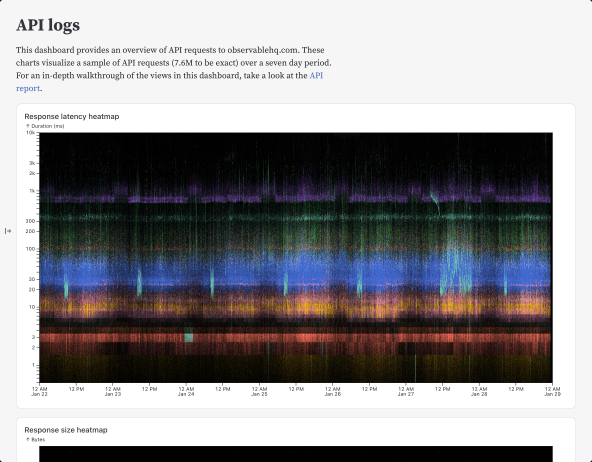
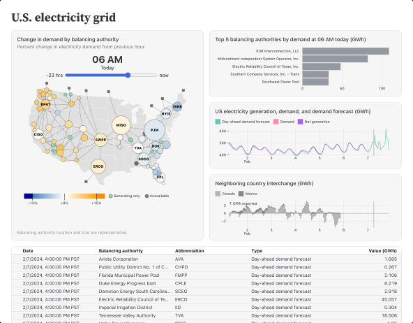
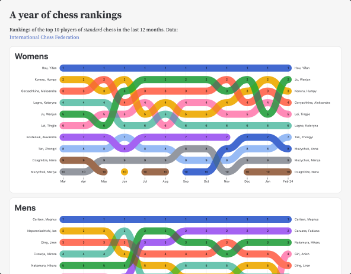
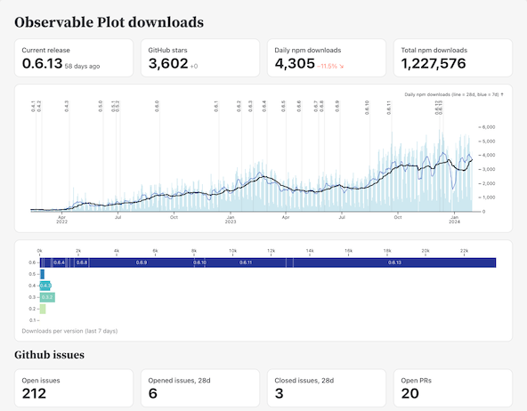

  <h1>The best dashboards are built with code.</h1>
  <h2>Create fast, beautiful data apps, dashboards, and reports from the command line. Write Markdown, JavaScript, SQL, Python, R… and any language you like. Free and open-source.</h2>
  

    <pre data-copy>npm init @observablehq</pre>
    <a href="./getting-started" class="small arrow">Get started</a>
  

  <a href="./examples/api/" target="_blank">
    <figure>
      <picture>
        <source srcset="./assets/api-logs-dark.png" media="(prefers-color-scheme: dark)">
        
      </picture>
      <figcaption class="arrow">Analyzing web logs</figcaption>
    </figure>
  </a>
  <a href="./examples/eia/" target="_blank">
    <figure>
      <picture>
        <source srcset="./assets/eia-dark.png" media="(prefers-color-scheme: dark)">
        
      </picture>
      <figcaption class="arrow">U.S. electricity grid</figcaption>
    </figure>
  </a>
  <a href="./examples/chess/" target="_blank">
    <figure>
      <picture>
        <source srcset="./assets/chess-dark.png" media="(prefers-color-scheme: dark)">
        
      </picture>
      <figcaption class="arrow">A year of chess rankings</figcaption>
    </figure>
  </a>
  <a href="./examples/plot/" target="_blank">
    <figure>
      <picture>
        <source srcset="./assets/plot-downloads-dark.png" media="(prefers-color-scheme: dark)">
        
      </picture>
      <figcaption class="arrow">Observable Plot downloads</figcaption>
    </figure>
  </a>

**Observable Framework** is an [open-source](https://github.com/observablehq/framework) static site generator for data apps, dashboards, reports, and more. Framework includes a preview server for local development, and a command-line interface for automating builds & deploys.

You write simple [Markdown](./markdown) pages — with interactive charts and inputs in [reactive JavaScript](./javascript), and with data snapshots generated by [loaders](./loaders) in _any_ programming language (SQL, Python, R, and more) — and Framework compiles it into a static site with instant page loads for a great user experience. Since everything is just files, you can use your preferred editor and source control, write unit tests, share code with other apps, integrate with CI/CD, and host projects anywhere.

Framework includes thoughtfully-designed [themes](./themes), [grids](./css/grid), and [libraries](./javascript/imports) to help you build displays of data that look great on any device, including [Observable Plot](./lib/plot), [D3](./lib/d3), [Vega-Lite](./lib/vega-lite), [Graphviz](./lib/graphviz), [Mermaid](./lib/mermaid), [Leaflet](./lib/leaflet), [KaTeX](./lib/tex), and myriad more. (And for working with data, don’t forget about [Arquero](./lib/arquero), [DuckDB](./lib/duckdb), and [SQLite](./lib/sqlite), too.)

Want the best dashboards? [Get started now.](./getting-started)
