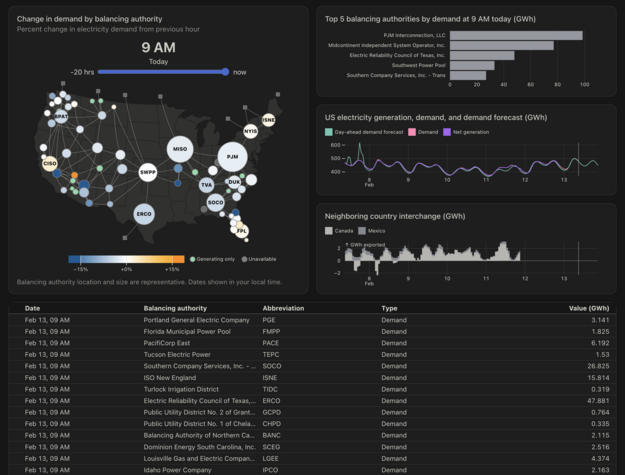

```js server echo
console.log(`The current version of Node is: <b>${process.env.npm_package_version}.`);
```

```sh server echo
uname -a
```

```sh server echo
date
```

<style>

.hero {
  margin: 4rem 0;
  text-wrap: balance;
}

.hero h1 {
  font-size: 56px;
  max-width: none;
  min-width: min-content;
  line-height: 1;
  margin: 2rem 0;
}

.hero h2 {
  font-style: normal;
  font-size: 18px;
  line-height: normal;
  color: var(--theme-foreground-muted);
}

.hero .observablehq-pre-container,
.hero pre:not(.observablehq-pre-container pre) {
  margin: 1rem 0;
}

.cta {
  display: flex;
  align-items: center;
  gap: 2rem;
}

@container not (min-width: 560px) {
  .cta {
    flex-direction: column;
    align-items: start;
    gap: 0;
  }
  .cta .observablehq-pre-container,
  .cta pre:not(.observablehq-pre-container pre) {
    width: 100%;
  }
}

.gallery {
  margin: 4rem -1rem;
  gap: 2rem;
  max-width: calc(640px + 2rem);
}

.gallery a {
  display: flex;
  flex-direction: column;
  align-items: center;
  gap: 0.5rem;
}

.gallery img {
  max-width: 100%;
  border-radius: 8px;
  box-shadow: 0 0 0 0.75px rgba(128, 128, 128, 0.2), 0 6px 12px 0 rgba(0, 0, 0, 0.2);
  aspect-ratio: 2500 / 1900;
}

@media (prefers-color-scheme: dark) {
  .gallery img {
    box-shadow: 0 0 0 0.75px rgba(128, 128, 128, 0.2), 0 6px 12px 0 rgba(0, 0, 0, 0.4);
  }
}

.gallery a:not(:hover, :focus) {
  color: var(--theme-foreground-muted);
}

.gallery a:hover img,
.gallery a:focus img {
  box-shadow: 0 0 0 0.75px var(--theme-foreground-focus), 0 6px 12px 0 rgba(0, 0, 0, 0.2);
}

.gallery figcaption {
  font-size: 12px;
  color: inherit;
}

.arrow {
  font-weight: 500;
}

.arrow::after {
  content: "→";
  display: inline-block;
  margin-left: 0.25rem;
}

</style>

<div class="hero">
  <h1>The best dashboards are built with <span style="color: var(--theme-foreground-focus);">code.</span></h1>
  <h2>Create fast, beautiful data apps, dashboards, and reports from the command line. Write Markdown, JavaScript, SQL, Python, R… and any language you like. Free and open-source.</h2>
  <div class="cta">
    <pre data-copy>npx <span class="win">"</span>@observablehq/framework@latest<span class="win">"</span> create</pre>
    <a href="./getting-started" class="small arrow" style="color: var(--theme-foreground-focus);">Get started</a>
  </div>
</div>

<div class="gallery grid grid-cols-2">
  <a href="https://observablehq.observablehq.cloud/framework-example-api/" target="_blank">
    <picture>
      <source srcset="./assets/api.webp" media="(prefers-color-scheme: dark)">
      
    </picture>
    <div class="small arrow">Analyzing web logs</div>
  </a>
  <a href="https://observablehq.observablehq.cloud/framework-example-plot/" target="_blank">
    <picture>
      <source srcset="./assets/plot.webp" media="(prefers-color-scheme: dark)">
      
    </picture>
    <div class="small arrow">Observable Plot downloads</div>
  </a>
  <a href="https://observablehq.observablehq.cloud/framework-example-mortgage-rates/" target="_blank">
    <picture>
      <source srcset="./assets/mortgage-rates.webp" media="(prefers-color-scheme: dark)">
      
    </picture>
    <div class="small arrow">Fixed-rate mortgages</div>
  </a>
  <a href="https://observablehq.observablehq.cloud/framework-example-eia/" target="_blank">
    <picture>
      <source srcset="./assets/eia.webp" media="(prefers-color-scheme: dark)">
      
    </picture>
    <div class="small arrow">U.S. electricity grid</div>
  </a>
</div>

**Observable Framework** is an [open-source](https://github.com/observablehq/framework) static site generator for data apps, dashboards, reports, and more. Framework includes a preview server for local development, and a command-line interface for automating builds & deploys.

You write simple [Markdown](./markdown) pages — with interactive charts and inputs in [reactive JavaScript](./javascript), and with data snapshots generated by [data loaders](./data-loaders) in _any_ programming language (SQL, Python, R, and more) — and Framework compiles it into a static site with instant page loads for a great user experience. Since everything is just files, you can use your preferred editor and source control, write unit tests, share code with other apps, integrate with CI/CD, and host apps anywhere.

Framework includes thoughtfully-designed [themes](./themes), [grids](./markdown#grids), and [libraries](./imports) to help you build displays of data that look great on any device, including [Observable Plot](./lib/plot), [D3](./lib/d3), [Mosaic](./lib/mosaic), [Vega-Lite](./lib/vega-lite), [Graphviz](./lib/dot), [Mermaid](./lib/mermaid), [Leaflet](./lib/leaflet), [KaTeX](./lib/tex), and myriad more. And for working with data in the client, there’s [DuckDB](./lib/duckdb), [Arquero](./lib/arquero), [SQLite](./lib/sqlite), and more, too.

Want the best dashboards? [Get started now.](./getting-started)
