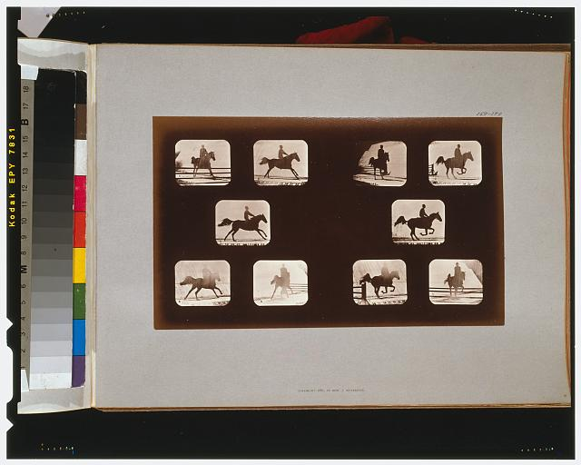

# Cards

The `card` class adds polished styling to page content including a background and border color determined by the page theme, default padding, and an optional title and subtitle that match title styling for other components. 

<div class="card">
  <h2>This is a card</h2>
  <h3>Cards add polished formatting to page content.</h3>
  ${
    Plot.plot({
      marks: [
        Plot.cell(weather, {x: d => d.date.getUTCDate(), y: d => d.date.getUTCMonth(),fill: "temp_max"})
      ]
    })
  }
</div>

```html run=false
<div class="card">
  <h2>This is a card</h2>
  <h3>Cards add polished formatting to page content.</h3>
  ${
    Plot.plot({
      marks: [
        Plot.cell(weather, {x: d => d.date.getUTCDate(), y: d => d.date.getUTCMonth(),fill: "temp_max"})
      ]
    })
  }
</div>
```

## Card content

Cards can contain whatever content you like, including text, images, charts, tables, inputs, and more.

<div class="grid grid-cols-2">
  <div class="card">
    <h2>Lorem ipsum</h2>
    <p>Id ornare arcu odio ut sem nulla pharetra. Aliquet lectus proin nibh nisl condimentum id venenatis a. Feugiat sed lectus vestibulum mattis ullamcorper velit. Aliquet nec ullamcorper sit amet. Sit amet tellus cras adipiscing. Condimentum id venenatis a condimentum vitae. Semper eget duis at tellus. Ut faucibus pulvinar elementum integer enim.</p>
    <p>Et malesuada fames ac turpis. Integer vitae justo eget magna fermentum iaculis eu non diam. Aliquet risus feugiat in ante metus dictum at. Consectetur purus ut faucibus pulvinar.</p>
  </div>
  <div class="card">
    
  </div>
  <div class="card">
    ${
      Plot.plot({
        marks: [
          Plot.rectY(olympians, Plot.binX({y: "count"}, {x: "weight"})),
          Plot.ruleY([0])
        ]
      })
    }
  </div>
  <div class="card">
    ${pickIndustry}
    ${Inputs.table(industries.filter(d => d.industry == industryInput))}
  </div>
</div>

```js echo
const pickIndustry = Inputs.select(industries.map(d => d.industry), {unique: true, label: "Industry:"});
const industryInput = view(pickIndustry)
```

```html run=false
<div class="grid grid-cols-2">
  <div class="card">
    <h2>Lorem ipsum</h2>
    <p>Id ornare arcu odio ut sem nulla pharetra. Aliquet lectus proin nibh nisl condimentum id venenatis a. Feugiat sed lectus vestibulum mattis ullamcorper velit. Aliquet nec ullamcorper sit amet. Sit amet tellus cras adipiscing. Condimentum id venenatis a condimentum vitae. Semper eget duis at tellus. Ut faucibus pulvinar elementum integer enim.</p>
    <p>Et malesuada fames ac turpis. Integer vitae justo eget magna fermentum iaculis eu non diam. Aliquet risus feugiat in ante metus dictum at. Consectetur purus ut faucibus pulvinar.</p>
  </div>
  <div class="card">
    
  </div>
  <div class="card">
    ${
      Plot.plot({
        marks: [
          Plot.rectY(olympians, Plot.binX({y: "count"}, {x: "weight"})),
          Plot.ruleY([0])
        ]
      })
    }
  </div>
  <div class="card">
    ${pickIndustry}
    ${Inputs.table(industries.filter(d => d.industry == industryInput))}
  </div>
</div>
```

## Title and subtitle

Card titles and subtitles are added with h2 and h3 headers, respectively, and match the title styling in [Observable Plot](https://observablehq.com/plot/features/plots#other-options):

<div class="grid grid-cols-2"">
  <div class="card">
    <h2>A card title added as an h2 element</h2>
    <h3>A card subtitle added as an h3 element</h3>
    <p>Lorem ipsum dolor sit amet, consectetur adipiscing elit, sed do eiusmod tempor incididunt ut labore et dolore magna aliqua. Ut enim ad minim veniam, quis nostrud exercitation ullamco laboris nisi ut aliquip ex ea commodo consequat.</p>
    <p>Massa sapien faucibus et molestie ac feugiat sed lectus. Sit amet volutpat consequat mauris nunc congue nisi. Maecenas pharetra convallis posuere morbi leo urna molestie at.</p>
  </div>
  <div class="card">
    ${
      Plot.plot({
        title: "A chart title added in Observable Plot",
        subtitle: "A chart subtitle added in Observable Plot",
        marks: [
          Plot.areaY(industries, {x: "date", y: "unemployed", fill: "industry"}),
        ]
      })
    }
  </div>
</div>

```html run=false
<div class="grid grid-cols-2"">
  <div class="card">
    <h2>A card title added as an h2 element</h2>
    <h3>A card subtitle added as an h3 element</h3>
    <p>Lorem ipsum dolor sit amet, consectetur adipiscing elit, sed do eiusmod tempor incididunt ut labore et dolore magna aliqua. Ut enim ad minim veniam, quis nostrud exercitation ullamco laboris nisi ut aliquip ex ea commodo consequat.</p>
    <p>Massa sapien faucibus et molestie ac feugiat sed lectus. Sit amet volutpat consequat mauris nunc congue nisi. Maecenas pharetra convallis posuere morbi leo urna molestie at.</p>
  </div>
  <div class="card">
    ${
      Plot.plot({
        title: "A chart title added in Observable Plot",
        subtitle: "A chart subtitle added in Observable Plot",
        marks: [
          Plot.areaY(industries, {x: "date", y: "unemployed", fill: "industry"}),
        ]
      })
    }
  </div>
</div>
```

## Content without cards

Page content does not have to be within a card. Below, explanatory text is added to the right of a card.

<div class="grid grid-cols-2"">
  <div class="card">
    ${
      Plot.plot({
        color: {legend: true},
        marks: [
          Plot.dot(penguins, {x: "body_mass_g", y: "flipper_length_mm", fill: "species", tip: true})
        ]  
      })
    }
  </div>
  <div>
    <p>Body mass (g) and flipper length (mm) for 344 individual penguins (${penguins.filter(d => d.species == "Adelie").length} Adélie, ${penguins.filter(d => d.species == "Chinstrap").length} Chinstrap, and ${penguins.filter(d => d.species == "Gentoo").length} Gentoo) recorded on Dream, Biscoe, or Torgersen islands near Palmer Archipelago, Antarctica from 2007 — 2009. Data source: <a href="https://journals.plos.org/plosone/article?id=10.1371/journal.pone.0090081">K. B. Gorman et al. 2014.</a> </p>
  </div>
</div>

```html run=false
<div class="grid grid-cols-2"">
  <div class="card">
    ${
      Plot.plot({
        color: {legend: true},
        marks: [
          Plot.dot(penguins, {x: "body_mass_g", y: "flipper_length_mm", fill: "species", tip: true})
        ]  
      })
    }
  </div>
  <div>
    <p>Body mass (g) and flipper length (mm) for 344 individual penguins (${penguins.filter(d => d.species == "Adelie").length} Adélie, ${penguins.filter(d => d.species == "Chinstrap").length} Chinstrap, and ${penguins.filter(d => d.species == "Gentoo").length} Gentoo) recorded on Dream, Biscoe, or Torgersen islands near Palmer Archipelago, Antarctica from 2007 — 2009. Data source: <a href="https://journals.plos.org/plosone/article?id=10.1371/journal.pone.0090081">K. B. Gorman et al. 2014.</a> </p>
  </div>
</div>
```