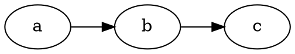
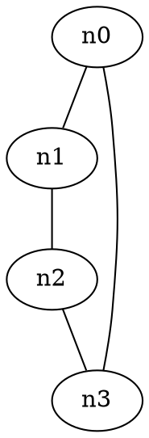
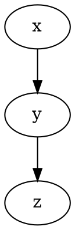
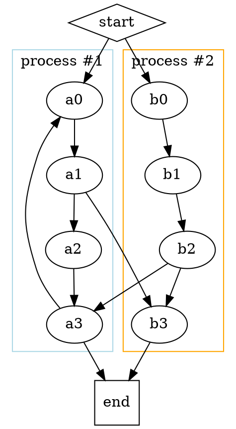

# DOT (Graphviz)

[DOT](https://graphviz.org/doc/info/lang.html) is a language for expressing node-link diagrams using [Graphviz](https://graphviz.org). Observable provides a `dot` tagged template literal powered by [Viz.js](https://github.com/mdaines/viz-js). This is available by default in Markdown, or you can import it like so:

```js echo
import dot from "npm:@observablehq/dot";
```

To use in a JavaScript code block:

```js echo
dot`digraph G {
  rankdir = LR
  a -> b -> c
}`
```

You can also write DOT in a `dot` fenced code block:

````md

````

This produces:


Here are some more examples.







If you don’t mind losing the conveniences of the built-in wrapper such as responsive light and dark mode, you can also use Viz.js directly. For example:

```js echo
import {instance} from "npm:@viz-js/viz";

const viz = await instance();

display(
  viz.renderSVGElement({
    directed: false,
    edges: [
      {tail: "a", head: "b"},
      {tail: "b", head: "c"},
      {tail: "c", head: "a"}
    ]
  })
);
```
