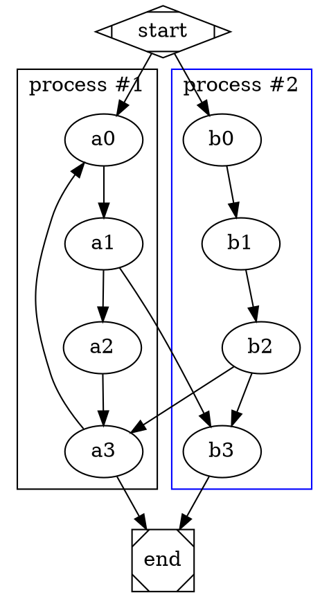

# DOT

[DOT](https://graphviz.org/doc/info/lang.html) is a language for expressing node-link diagrams using [Graphviz](https://graphviz.org). Observable Markdown’s implementation is powered by [Viz.js](https://github.com/mdaines/viz-js).

To use DOT, write a `dot` fenced code block:

````md

````

This produces:


Here are some more examples.



