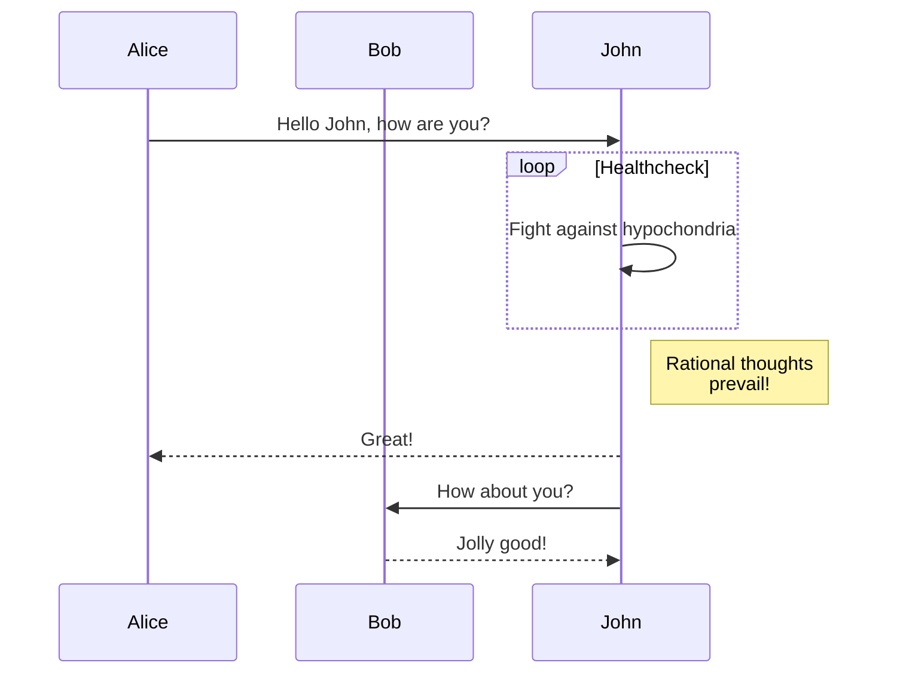
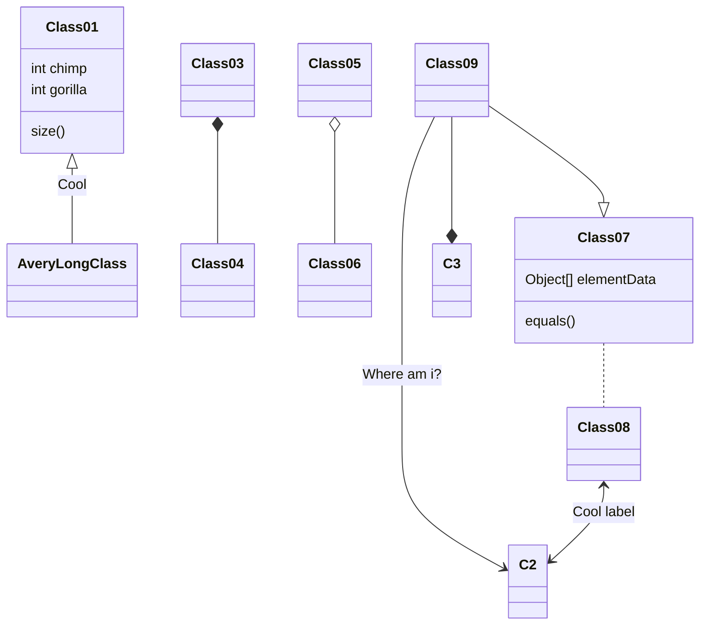

# Mermaid

[Mermaid](https://mermaid.js.org/) is a language for expressing node-link diagrams, flowcharts, sequence diagrams, and many other types of visualizations. (See also [DOT](./dot).) Observable provides a `mermaid` tagged template literal for convenience. This is available by default in Markdown, or you can import it like so:

```js echo
import mermaid from "npm:@observablehq/mermaid";
```

To use in a JavaScript code block:

```js echo
mermaid`graph TD;
    A-->B;
    A-->C;
    B-->D;
    C-->D;`
```

You can also write Mermaid in a `mermaid` fenced code block:

````md

````

This produces:


Here are some more examples.




