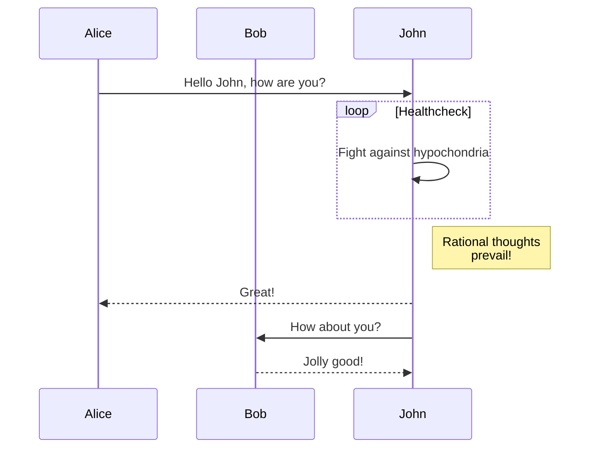
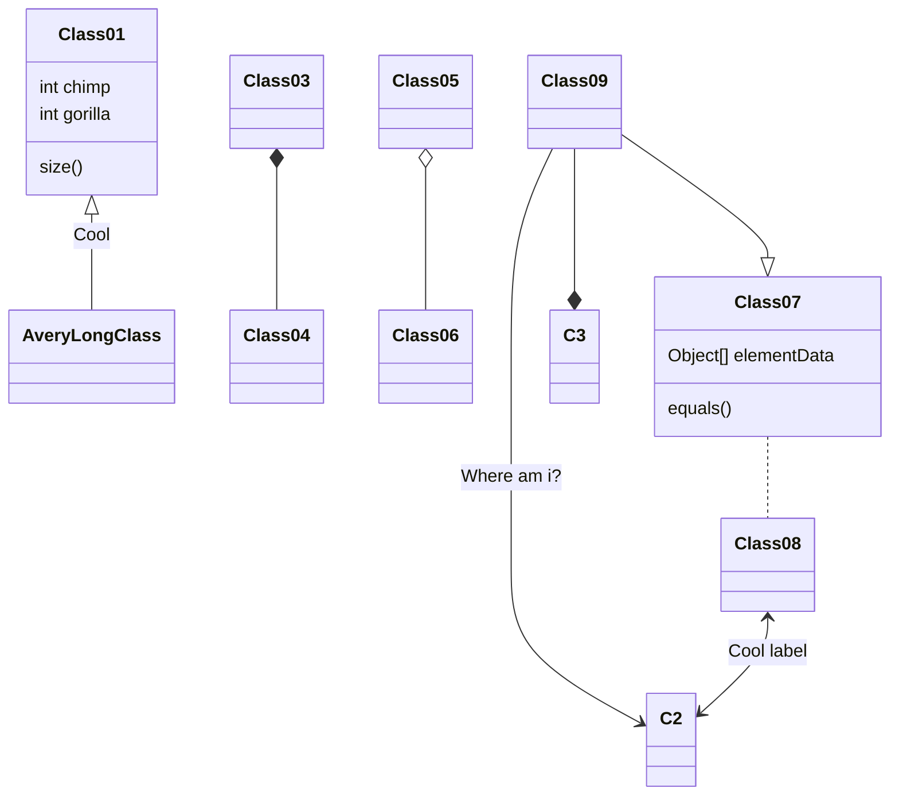

# Mermaid

[Mermaid](https://mermaid.js.org/) is a language for expressing node-link diagrams, flowcharts, sequence diagrams, and many other types of visualizations. (See also [DOT](./dot).)

To use Mermaid, write a `mermaid` fenced code block:

````md

````

This produces:


Here are some more examples.




