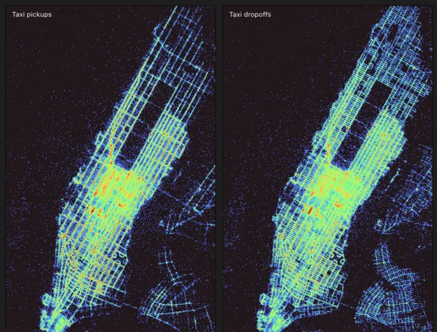

# What is Framework?

Observable Framework — or “Framework” for short — is an open-source static-site generator for data apps. By *data app* we mean an application that is primarily a display of data. Data apps help you derive insights (to understand) and evaluate potential decisions (to take action).

A data app might be a set of coordinated **interactive visualizations** for “self-service” exploratory analysis, perhaps to better understand a computational model or to investigate activity;

  <a href="https://observablehq.com/framework/lib/mosaic" target="_blank">
    <picture>
      
    </picture>
    
Taxi rides in New York City

  </a>

… a **live dashboard** that shows what is currently happening, placing current events in context of recent or historical trends;

  <a href="https://observablehq.com/framework/examples/plot/">
    <picture>
      <source srcset="./assets/plot.webp" media="(prefers-color-scheme: dark)">
      
    </picture>
    
Observable Plot downloads

  </a>

… a **point-in-time report** that combines graphics and prose to present in-depth analysis, perhaps with recommendations or hypotheses about observed behavior;

  <a href="https://observablehq.com/framework/examples/api/">
    <picture>
      <source srcset="./assets/api.webp" media="(prefers-color-scheme: dark)">
      
    </picture>
    
Analyzing web logs

  </a>

… or any number of other displays of data. Data apps are useful in almost every domain: business intelligence, product analytics, monitoring operations, scientific reporting, and more. Data apps are tools for thought — for answering questions, exploring possibilities, organizing knowledge, and communicating insights.

Why use Framework for your data app? Here are a few reasons.

## The power of code

Good data apps are highly customized — they present an opinionated perspective, and reflect the organization’s brand. Point-and-click tools may be easy to use but suffer limited expressivity and power. With code, there’s no limit to what you can create. (For inspiration, see our [D3](https://observablehq.com/@d3/gallery) and [Plot](https://observablehq.com/@observablehq/plot-gallery) galleries.)

Modern development is a marvel. Framework is free and open-source, and projects are just local files, making it easy to incorporate into your existing workflow. Use your preferred code editor, source control, and code review system. Write unit tests. Run linters. Automate builds with continuous integration or deployment. Work offline. Self-host. Generate or revise content programmatically, whether with AI or simply to bulk find-and-replace.

## Polyglot meets the web

Most web application frameworks focus on a single language — JavaScript, Python, or R. Framework is different. Framework is _polyglot_: it brings multiple languages together. This approach is especially valuable for data apps where data teams have their preferred language(s) for data analysis, but want to leverage the full power of JavaScript for interactive graphics. Have your cake and eat it too. 🍰

In Framework, you can save changes to a Python or R data loader and then immediately see the results in a JavaScript visualization. Framework’s preview server automatically watches for changes and re-runs the data loader, pushing updates to the browser over a socket. And thanks to reactivity, the browser can efficiently recompute exactly what’s needed to update the display.

Whether your team prefers Python, R, SQL, or even some new language you invented, Framework will give you a best-in-class developer experience and help you build a better data app.

## Static-site architecture

Framework’s data architecture practically forces your app to be fast because data is precomputed at build time. Performance is critical for dashboards: users don’t like to wait, and dashboards only create value if users look at them. Furthermore, data snapshots can be highly-optimized (and aggregated and anonymized), minimizing what you send to the client. And since data loaders run only during build, viewers don’t need direct access to the underlying data sources and your dashboards are more secure and robust.

The speed of modern data warehouses is astonishing. But far too often something is missing for new analysis — some untapped data source, some not-yet-materialized view. Framework’s data loaders let you bypass these hurdles and produce a fast dashboard without “heavy lifting” in your data warehouse. Framework lets you build faster and quickly validate your ideas.

## Automatic reactivity

Like Observable notebooks, Observable Framework has language-level support for reactivity. Instead of wrangling hooks or signals, you can write declarative code in vanilla JavaScript that is automatically re-run whenever variables change, much like a spreadsheet. This helps you build complex, interactive data apps that are easier to understand and maintain.

## An end-to-end solution

We believe that well-designed tools help developers build more efficiently by focusing their efforts on high-value, creative work. We favor opinionated tools, with defaults and conveniences that foster a good user experience. We believe Framework will help you build better data apps. And since Framework seamlessly integrates with Observable, you can easily and securely share your data apps with your team or the world.
