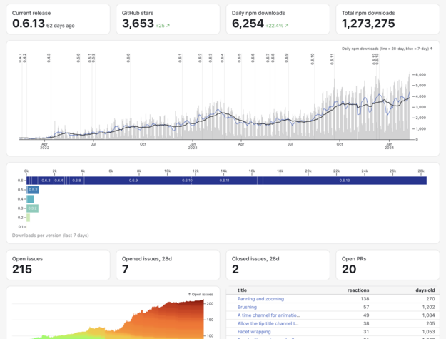

# What is Framework?

Observable Framework — or “Framework” for short — is an open-source static-site generator for data apps. A *data app* is an application that is primarily a display of data. A data app helps you derive insights from data (to better understand) and evaluate potential decisions (to better take action). A data app might be:

* a **live dashboard** that shows what is currently happening, placing current events in context of recent or historical trends, or
* a **point-in-time report** that combines graphics and prose to present in-depth analysis, perhaps with recommendations or hypothesized explanations of observed behavior, or
* a set of **interactive visualizations** that allow “self-service” exploratory analysis, perhaps to better understand a model or to investigate activity.

Whereas data warehouses are tools for data — storing records and executing queries — data apps are tools for thought — organizing knowledge and sharing insights. As such, data apps tend to be highly opinionated and customized to the bespoke demands of a data-driven organization.

**Interactive visualization** - self-service exploration of data through an opionated interface.

TODO Mosaic taxis visualization.

**Dashboards** - putting current performance in context — how are things going?

  <a href="./examples/plot/" target="_blank">
    <picture>
      <source srcset="./assets/plot-dark.webp" media="(prefers-color-scheme: dark)">
      
    </picture>
    
Observable Plot downloads

  </a>

**Reports** - point-in-time analysis, in depth. More prose, more context.

  <a href="./examples/api/" target="_blank">
    <picture>
      <source srcset="./assets/api-dark.webp" media="(prefers-color-scheme: dark)">
      
    </picture>
    
Analyzing web logs

  </a>

Framework’s emphasis on client-side JavaScript affords fantastic expressivity for custom, performant, interactive graphics. And Framework’s polyglot data loader architecture affords limitless flexibility preparing and crunching data. Whether your team prefers Python, R, SQL, or something else, Framework can help you build a better data app. Framework can be used for business intelligence, product analytics, monitoring, and more.

Why should you use Framework? Here are a few reasons.

## Framework is code

Business intelligence as code. Alternative to custom web development.

Open-source. File-based development.

Framework is free and open-source. Projects are just local files. Use your favorite editor, preview locally, check it all into git, write unit tests, add CI/CD, even work offline. You can host projects anywhere or deploy instantly to Observable to share them securely with your team.

Modern development is built on files. Files have myriad strengths, but the strongest is interoperability. When every tool uses files, it’s far easier to incorporate a new tool — and now Observable — into your workflow.

This isn’t just about using your preferred text editor. Now you can bring your own source control and code review system, too. You can write unit tests and run linters. You can automate builds with continuous integration or deployment. You can work offline. You can self-host. You can generate or edit content programmatically, say to format code or to find-and-replace across files.

## Framework is polyglot

Multiple languages working together.

## Framework is static

Fewer moving parts. Easier to host anywhere. Great performance.

A toolmaker can’t care only about the developer experience — what does the developer experience matter if the resulting app is not demonstrably better? The merit of a creative tool should be judged by the quality of its creations, not its process. Or: “the proof of the pudding is in the eating.”

We believe that well-designed tools help developers build more efficiently by focusing their efforts on high-value work. We favor opinionated tools, with defaults and conveniences that foster a good user experience. We nudge you into the pit of success.

Framework’s lightweight Markdown syntax — with light and dark mode, thoughtful colors, responsive grids, and built-in navigation — gives you beautiful pages from the start. It’s highly customizable if you need it, but it’s quick to get started with batteries included.

Most importantly, Framework’s data architecture practically forces your app to be fast because data is precomputed. Performance is critical for dashboards: users don’t like to wait, and dashboards only create value if users look at them. Slow dashboards waste time. (And you certainly don’t want your database and dashboard falling over under load!)

Observable Framework solves the “last mile” problem of data apps: loading data. Conventional dashboards are slow because they run queries on view while the user waits; Framework’s data loaders run on build so that pages load instantly. And because data loaders run on your servers, you control privacy and security.

Framework’s data loaders solve this “last mile” problem by computing static data snapshots at build time. These snapshots can be highly-optimized (and aggregated and anonymized), minimizing the data you send to the client. And since a data loader is just a fancy way of generating a file on-demand (with clever caching and routing), loaders can be written in any language and use any library. This flexibility is not unlike CGI from 30 years ago, and Unix pipes. And since data loaders run on your servers, viewers don’t need direct access to the underlying data sources, and your dashboards are more secure and robust.

The speed of modern data warehouses is astonishing. But far too often something is missing for new analysis — some untapped data source, some not-yet-materialized view for a query to run at interactive speeds. Framework’s data loaders let you bypass these hurdles and produce a fast dashboard without “heavy lifting” in your data warehouse. And once your analysis demonstrates value, you can shift work to your data warehouse and simplify your data loaders. Framework lets you build faster and quickly validate your ideas.

We believe Framework will change how you think about data, and effect a better user experience. And by securely hosting apps alongside notebooks, Observable now offers an end-to-end solution for data analysis and presentation.

## Framework is reactive

Data visualization. User interaction. Real-time updates.
