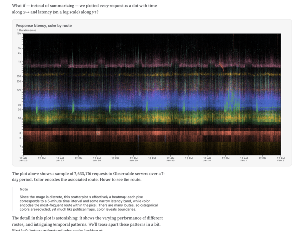
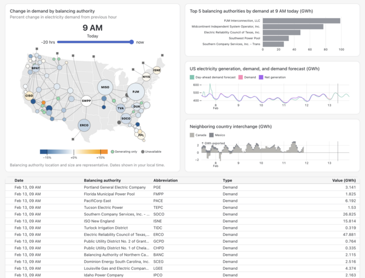
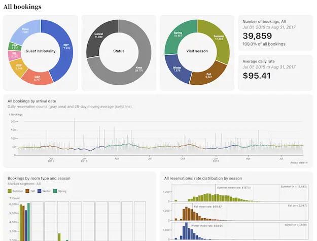
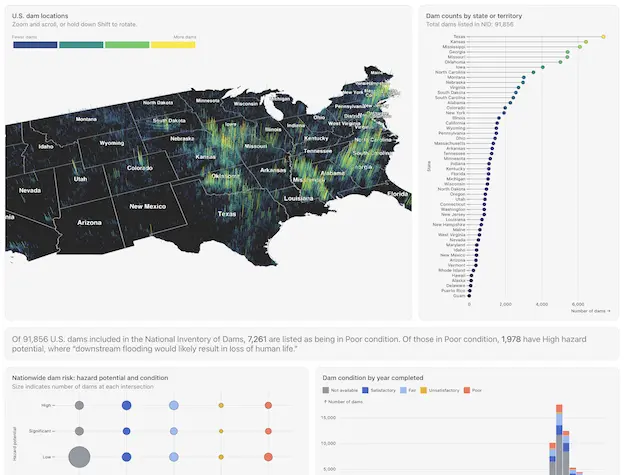

# Observable Framework examples

> [!NOTE]
> To get started with Framework, please read [_Getting started_](https://observablehq.com/framework/getting-started).

## Showcase examples 🖼️

### [`api`](https://observablehq.observablehq.cloud/framework-example-api/) - Analyzing web logs

<a href="https://observablehq.observablehq.cloud/framework-example-api/"></a>

[Source](./api) · This report visualizes millions of requests to Observable’s API servers over a 7-day period in January 2024, revealing both traffic patterns and performance characteristics of Observable’s web service. This example showcases the flexibility of Observable Plot for creating custom, performant visualizations, and hints at the potential of Framework’s data loaders for working with large datasets. This example also demonstrates reading [Apache Parquet files](https://observablehq.com/framework/lib/arrow). (While this public example uses static data, at Observable we use [Snowflake data loaders](https://observablehq.observablehq.cloud/framework-example-loader-snowflake/) internally to create a similar live dashboard.)

### [`eia`](https://observablehq.observablehq.cloud/framework-example-eia/) - U.S. electricity grid

<a href="https://observablehq.observablehq.cloud/framework-example-eia/"></a>

[Source](./eia) · This dashboard visualizes electricity generation and demand across the U.S. electricity grid. The included data loaders demonstrate how to retrieve live data from the U.S. Energy Information Administration (EIA) API, while the dashboard demonstrates how to produce interactive maps, bar charts, and time-series charts with Observable Plot. A range input allows the user to rewind time to any point in the previous 24 hours, and a table shows details.

### [`food-imports`](https://observablehq.observablehq.cloud/framework-example-food-imports/) - Food imports

<a href="https://observablehq.observablehq.cloud/framework-example-food-imports/"></a>

[Source](./food-imports) · This dashboard visualizes the distribution of food imports to the United States. With complex data, advanced chart types. Hierarchical and relative values, adapting / small ammendations to existing chart types. Marimekko, Sunburst, and normalized stream graph. Explain each, mention source. Approach.

### [`hotel-bookings`](https://observablehq.observablehq.cloud/framework-example-hotel-bookings) - Resort hotel bookings

<a href="https://observablehq.observablehq.cloud/framework-example-hotel-bookings/"></a>

[Source](./hotel-bookings) · This dashboard visualizes hotel bookings by market segment for a Portuguese resort from 2015 to 2017. The dashboard demonstrates how to produce interactive charts with D3 and Observable Plot, either created as JavaScript components or directly within a markdown file. Donut charts, histograms, a bubble chart and a line chart reveal patterns in room bookings, prices, guest nationalities, and cancellations across different market segments and seasons.

### [`plot`](https://observablehq.observablehq.cloud/framework-example-plot/) - Observable Plot downloads

<a href="https://observablehq.observablehq.cloud/framework-example-plot/"></a>

[Source](./plot) · This dashboard visualizes the popularity and development of [Observable Plot](https://observablehq.com/plot/), our open-source visualization library. The included data loaders demonstrate how to retrieve data from GitHub and npm APIs, including star counts, releases, downloads, and open issues. A time-series chart shows daily npm downloads with 7- and 28-day moving averages, and a burndown chart shows the age of open issues over time.

### [`mortgage-rates`](https://observablehq.observablehq.cloud/framework-example-mortgage-rates/) - Primary mortgage market survey

<a href="https://observablehq.observablehq.cloud/framework-example-mortgage-rates/"></a>

[Source](./mortgage-rates) · This dashboard visualizes Freddie Mac’s historical mortgage rates data. The included data loader demonstrates how to retrieve CSV data from Freddie Mac and visualize the result as a zoomable chart with Observable Plot. The larger time-series line chart at the bottom allows brushing to select an arbitrary time range, while the smaller visualization above zooms to show the selected range.

### [`us-dams`](https://observablehq.observablehq.cloud/framework-example-us-dams/) - U.S. dam conditions

<a href="https://observablehq.observablehq.cloud/framework-example-us-dams/"></a>

[Source](./us-dams) · This dashboard visualizes locations and conditions for 90k+ dams in the U.S. with data from the National Inventory of Dams (NID). An R data loader accesses the data directly from the NID and generates a simplified CSV. Maps created with deck.gl allow a user to zoom and scroll while exploring dam locations nationwide, or by state. Bar and bubble charts made in Observable Plot highlight dam conditions and hazard potential.

## Technique examples 🛠️

### Charts

- [`geotiff`](https://observablehq.observablehq.cloud/framework-example-geotiff/) - Parse GeoTIFF with geotiff.js, then visualize with Observable Plot
- [`netcdf`](https://observablehq.observablehq.cloud/framework-example-netcdf/) - Parse NetCDF with `netcdfjs`, then visualize with Observable Plot
- [`vega-dark`](https://observablehq.observablehq.cloud/framework-example-vega-dark/) - Responsive dark mode in Vega-Lite
- [`vega-responsive`](https://observablehq.observablehq.cloud/framework-example-vega-responsive/) - Responsive width in Vega-Lite using ResizeObserver

### Data loaders

- [`loader-airtable`](https://observablehq.observablehq.cloud/framework-example-loader-airtable/) - Load data from Airtable
- [`loader-arrow`](https://observablehq.observablehq.cloud/framework-example-loader-arrow/) - Generate Apache Arrow IPC files
- [`loader-canvas-to-png`](https://observablehq.observablehq.cloud/framework-example-loader-canvas-to-png/) - Generate PNG using node-canvas
- [`loader-census`](https://observablehq.observablehq.cloud/framework-example-loader-census/) - Load and transform shapefiles from the U.S. Census Bureau
- [`loader-databricks`](https://observablehq.observablehq.cloud/framework-example-loader-databricks/) - Load data from Databricks
- [`loader-duckdb`](https://observablehq.observablehq.cloud/framework-example-loader-duckdb/) - Process data with DuckDB
- [`loader-elasticsearch`](https://observablehq.observablehq.cloud/framework-example-loader-elasticsearch/) - Load data from Elasticsearch
- [`loader-github`](https://observablehq.observablehq.cloud/framework-example-loader-github/) - Load data from GitHub
- [`loader-google-analytics`](https://observablehq.observablehq.cloud/framework-example-loader-google-analytics/) - Load data from Google Analytics
- [`loader-julia-to-txt`](https://observablehq.observablehq.cloud/framework-example-loader-julia-to-txt/) - Generate TXT from Julia
- [`loader-parquet`](https://observablehq.observablehq.cloud/framework-example-loader-parquet/) - Generat Apache Parquet files
- [`loader-postgres`](https://observablehq.observablehq.cloud/framework-example-loader-postgres/) - Load data from PostgreSQL
- [`loader-python-to-csv`](https://observablehq.observablehq.cloud/framework-example-loader-python-to-csv/) - Generate CSV from Python
- [`loader-python-to-parquet`](https://observablehq.observablehq.cloud/framework-example-loader-python-to-parquet) - Generate Apache Parquet from Python
- [`loader-python-to-png`](https://observablehq.observablehq.cloud/framework-example-loader-python-to-png/) - Generate PNG from Python
- [`loader-python-to-zip`](https://observablehq.observablehq.cloud/framework-example-loader-python-to-zip/) - Generate ZIP from Python
- [`loader-r-to-csv`](https://observablehq.observablehq.cloud/framework-example-loader-r-to-csv/) - Generate CSV from R
- [`loader-r-to-jpeg`](https://observablehq.observablehq.cloud/framework-example-loader-r-to-jpeg/) - Generate JPEG from R
- [`loader-r-to-json`](https://observablehq.observablehq.cloud/framework-example-loader-r-to-json/) - Generate JSON from R
- [`loader-r-to-zip`](https://observablehq.observablehq.cloud/framework-example-loader-r-to-zip/) - Generate ZIP from R
- [`loader-rust-to-json`](https://observablehq.observablehq.cloud/framework-example-loader-rust-to-json/) - Generate JSON from Rust
- [`loader-snowflake`](https://observablehq.observablehq.cloud/framework-example-loader-snowflake/) - Load data from Snowflake
- [`netcdf-contours`](https://observablehq.observablehq.cloud/framework-example-netcdf-contours/) - Convert NetCDF to GeoJSON with `netcdfjs` and `d3-geo-voronoi`

### Inputs

- [`codemirror`](https://observablehq.observablehq.cloud/framework-example-codemirror/) - A text input powered by CodeMirror
- [`custom-input-2d`](https://observablehq.observablehq.cloud/framework-example-custom-input-2d/) - A custom 2D input with bidirectional binding
- [`input-select-file`](https://observablehq.observablehq.cloud/framework-example-input-select-file/) - Select a file from a drop-down menu

### Markdown

- [`markdown-it-container`](https://observablehq.observablehq.cloud/framework-example-markdown-it-container/) - The markdown-it-container plugin
- [`markdown-it-footnote`](https://observablehq.observablehq.cloud/framework-example-markdown-it-footnote/) - The markdown-it-footnote plugin
- [`markdown-it-wikilinks`](https://observablehq.observablehq.cloud/framework-example-markdown-it-wikilinks/) - The markdown-it-wikilinks plugin

### Other

- [`chess`](https://observablehq.observablehq.cloud/framework-example-chess/) - Load Zip data from FIDE; create a bump chart with Observable Plot
- [`custom-stylesheet`](https://observablehq.observablehq.cloud/framework-example-custom-stylesheet/) - Define a custom stylesheet (custom theme)
- [`google-analytics`](https://observablehq.observablehq.cloud/framework-example-google-analytics/) - A Google Analytics dashboard with numbers and charts
- [`hello-world`](https://observablehq.observablehq.cloud/framework-example-hello-world/) - A minimal Framework project
- [`intersection-observer`](https://observablehq.observablehq.cloud/framework-example-intersection-observer/) - Scrollytelling with IntersectionObserver
- [`responsive-iframe`](https://observablehq.observablehq.cloud/framework-example-responsive-iframe/) - Adjust the height of an embedded iframe to fit its content

## About these examples

We offer two types of examples: **techniques** and **showcases**.

Technique examples address lower-level needs such as “how to load data from Google Analytics” or “how to make a bump chart”. They’re smaller, piecemeal examples for common development tasks. Technique examples are intended to teach you how to accomplish a specific task and to provide reusable code that can be copy-pasted into your Framework project.

Showcase examples, in contrast, address higher-level user needs such as “how to analyze website traffic” or “how to show the growth of an open-source project”. These larger, complete examples demonstrate how to create useful data apps. Showcase examples are intended primarily to inspire and show Framework’s potential. As applied examples, showcase examples also demonstrate multiple techniques working together; we encourage you to view source.

### How to use these examples

You can browse the source code for any of the examples by navigating to the respective folder on GitHub. You can then copy-paste the code into your own project or download individual files. All of the example code in this repository is covered by the same [open-source license](../LICENSE) as Framework itself.

If you’d like to run (and tinker with) these examples locally, you can [clone the repo](https://docs.github.com/en/repositories/creating-and-managing-repositories/cloning-a-repository) like so:

```sh
git clone git@github.com:observablehq/framework.git
```

Then `cd` into the desired example directory. From there you would typically run `npm install` or `yarn` to install dependencies. Please refer to each example’s `README.md` file for specific instructions; some examples may require additional configuration, such as setting environment variables to talk to external data sources.

### Can’t find what you need? 🧐

If there’s an example you’d like to see, please let us know by [filing an issue](https://github.com/observablehq/framework/issues).

If you have questions about an existing example, please [open a discussion](https://github.com/observablehq/framework/discussions).

### We welcome contributions! 🤗

If you have an example that you’d like to share with the community, please [open a pull request](https://docs.github.com/en/pull-requests). Please follow the conventions set by the existing examples and let us know if you have any questions.

Here are some technique examples we’d like to see:

- Visualization
  - Big number with area chart
  - Daily metric chart with moving average
  - Punchcard chart (activity by day of week and hour of day)
  - Bump chart/rank chart
  - Brushing
  - Zooming
- Data loaders
  - JSZip data loader
  - npm data loader
- Markdown
  - Inline TeX `$…$`
