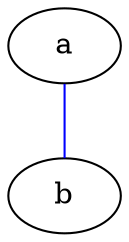

# Cells

Simple display

```js echo
const x = 1;
const y = 2;
display(x)
display(y)
```

Local imports

```js echo
import {capitalizeFirstLetter, formatCount} from "./format.js";
import formatTitle from "./format.js";
const capitalize = capitalizeFirstLetter("hello");
const count = formatCount(123456789);
display(capitalize);
display(count);
```

NPM imports

```js echo
import confetti from "npm:canvas-confetti";
```

# HTML

<details>
  <summary>Click me</summary>
  This text is not visible by default.
</details>


# Graphviz



# Tex

```tex
E = mc^2
```

