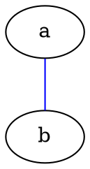

# Code

# HTML

<details>
  <summary>Click me</summary>
  This text is not visible by default.
</details>


# Graphviz


```dot echo
  strict graph { 
    a -- b
    a -- b
    b -- a [color=blue]
  }
```

# Tex

```tex
E = mc^2
```

